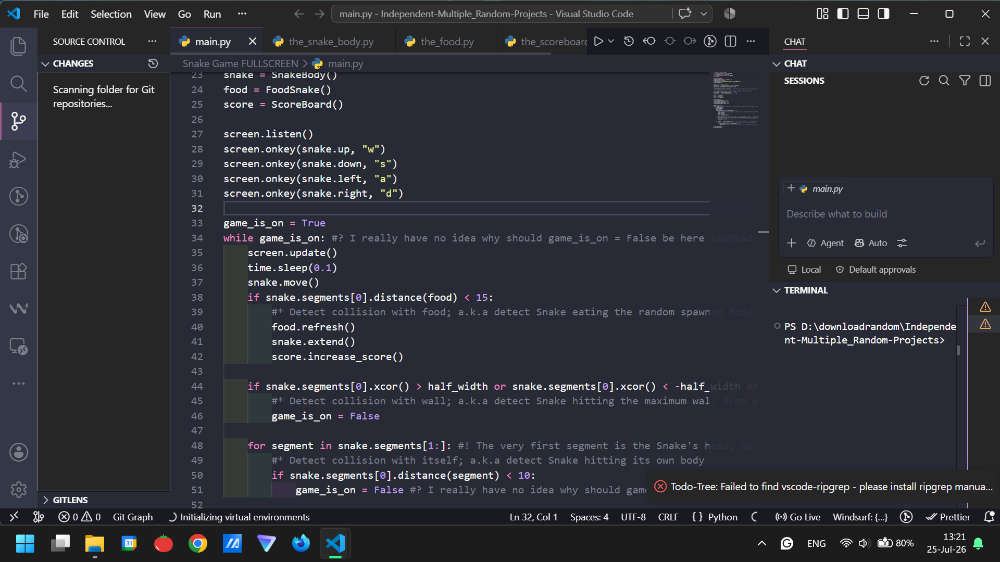
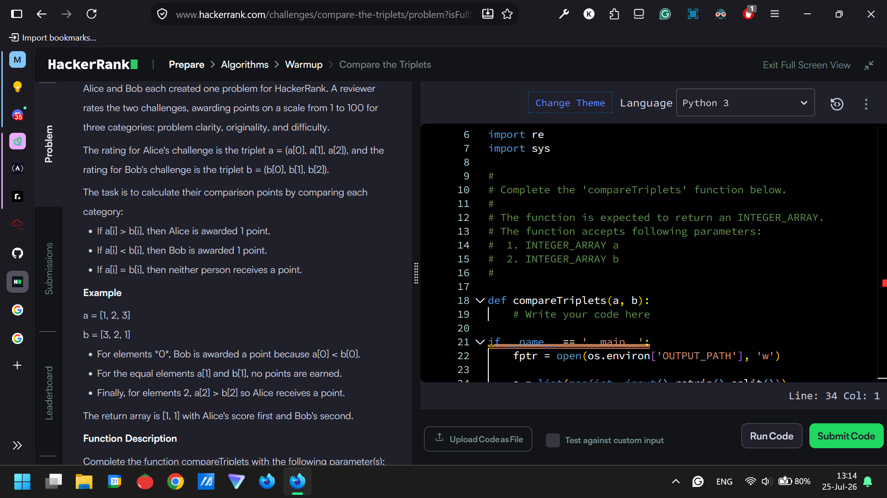
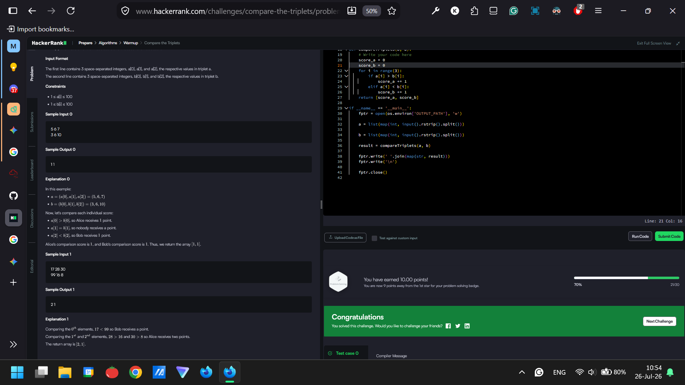
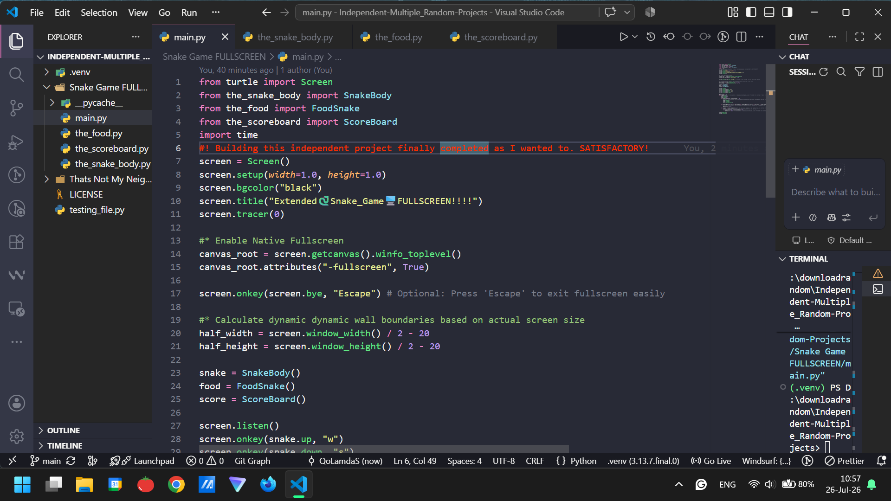
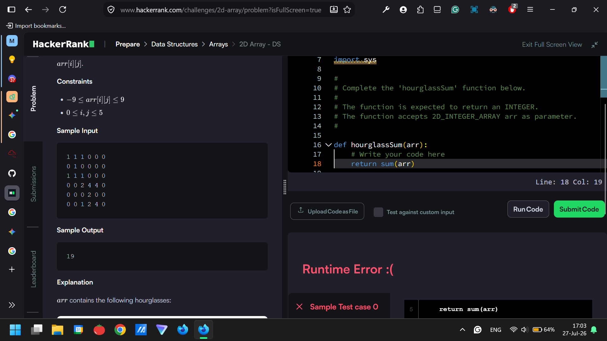

# ALL OF MY PREVIOUS 100DaysOfCode Challenge JOURNALS IS ALL HERE = https://github.com/QoLamdaS/Projects_Udemy_100DaysOfPython_byAngelaYu.git

Day 33/100 R3: 28 May 2026, Thursday (≈75mins ; >25mins✅)
> What have I done today?
- Officially using this repo as a my UNIVERSAL 100DaysOfCodeChallenge JOURNALS; ditching from the previous 100DaysOfCodeChallenge that was only inside the Udemy Dr. Angela Python Course repo.
- I will use this repo as my UNIVERSAL 100DaysOfCodeChallenge JOURNALS "forever hopefully".
- The reason why I finally starting this repo is primarily to journal all of my works in a day beyond just inside Udemy Dr. Angela Python Course repo. So it can be included for example FreeCodeCamp courses, Codeforces, Codewars, my independent projects, open-source contributions, Etc.
- TL;DR => To be significantly more FLEXIBLE & ADAPTABLE journaling beyond just rigid journaling
- Hopefully, I'm consistent with journaling this every day 100DaysOfCodeChallenge.
- HAPPY CODING!!!
- HAPPY LEARNING!!!

Day 34/100 R3: 29 May 2026, Friday (≈25mins ; >25mins✅)
> What have I done today?
- I'm stuck on "Debug an ISBN Validator (Lab)" in FCC (FreeCodeCamp) website Python Certification course about Python exception handling.
- I have no idea how to fix that.
- Happy Coding!
- Happy Learning!

Day 35/100 R3: 30 May 2026, Saturday (≈25mins ; >25mins✅)
> What have I done today?
- I'm still stuck on completing "Debug an ISBN Validator (Lab)" in FreeCodeCamp website Python Certification course about Python exception handling. I really have no idea how finish this.
- Happy Coding!
- Happy Learning!

Day 36/100 R3: 31 May 2026, Sunday (≈5mins ; >25mins❌)
> What have I done today?
- Still stuck on completing "Debug an ISBN Validator (Lab)" in FreeCodeCamp website Python Certification course about Python exception handling.
- Just Showing Up today. I'm busy.
- Happy Coding!
- Happy Learning!

Day 37/100 R3: 1 June 2026, Monday (≈5mins ; >25mins❌)
> What have I done today?
- Still stucking on "Debug an ISBN Validator (Lab)" in FreeCodeCamp website Python Certification course about Python exception handling. Just Showing Up today. I'm so busy today.
- Happy Learning!

Day 38/100 R3: 3 June 2026, Wednesday (≈5mins ; >25mins❌)
> What have I done today?
- I completely forgot to do "programming" yesterday. I really forgot and was so busy yesterday. I missed yesterday :)
- Still stuck on "Debug an ISBN Validator (Lab)" in the FreeCodeCamp website Python Certification course about Python exception handling. 
- Just Showing Up today. I'm also really busy today.
- Happy Learning!

Day 39/100 R3: 4 June 2026, Thursday (≈5mins ; >25mins❌)
> What have I done today?
- Completed "Error Handling Review" on the FCC website Python Certification.
- Just Showing Up. Today I'm really busy and so lazy =)
- Happy Learning!

Day 40/100 R3: 5 June 2026, Friday (≈5mins ; >25mins❌)
> What have I done today?
- Just Showing Up reviewing concepts.
- Really so lazy and really unmotivated to do. Keep Showing Up
- Happy Learning!

Day 41/100 R3: 6 June 2026, Saturday (≈5mins ; >25mins❌)
> What have I done today?
- Working in Classes and Objects "Build a Musical Instrument Inventory (Workshop)" in FreeCodeCamp website Python Certification for at least reviewing my OOP concepts. Just Showing Up today.
- Happy Learning!
- Happy Coding!

Day 42/100 R3: 7 June 2026, Sunday (≈5mins ; >25mins❌)
> What have I done today?
- Just Showing Up today. Today I have some urgent things to do right now.
- Happy Learning!

Day 43/100 R3: 8 June 2026, Monday (≈10mins ; >25mins❌)
> What have I done today?
- Still working on Classes and Objects "Build a Musical Instrument Inventory (Workshop)" in the FCC Website Python Certification for reviewing my OOP concepts. 
- Just Showing Up today. I got a common cold today.
- Happy Learning!
- Happy Coding!

Day 44/100 R3: 9 June 2026, Tuesday (≈10mins ; >25mins❌)
> What have I done today?
- Completing Step 4/10->5/10 on Classes and Objects "Build a Musical Instrument Inventory (Workshop)" in the FreeCodeCamp Website Python Certification.
- Just Showing Up today. I'm too lazy to do programming today.
- Happy Learning!
- Happy Coding!

Day 45/100 R3: 10 June 2026, Wednesday (≈5mins ; >25mins❌)
> What have I done today?
- Completing Step 5/10->6/10 on Classes and Objects "Build a Musical Instrument Inventory (Workshop)" in the FCC Website Python Certification.
- Just Showing Up today. I'm too lazy and also busy to do programming today.
- Happy Learning!
- Happy Coding!

Day 46/100 R3: 11 June 2026, Thursday (≈5mins ; >25mins❌)
> What have I done today?
- Completing Step 6/10->7/10 on Classes and Objects "Build a Musical Instrument Inventory (Workshop)" in the FCC Website Python Certification.
- Just Showing Up today. I'm feel too lazy and really exhausted to do programming.
- Happy Learning!
- Happy Coding!

Day 47/100 R3: 12 June 2026, Friday (≈5mins ; >25mins❌)
> What have I done today?
- Completing Step 7/10->8/10 on Classes and Objects "Build a Musical Instrument Inventory (Workshop)" in the FCC Website Python Certification.
- Just Showing Up today. I'm feel very unmotivated, bored, and really exhausted to do programming.
- Happy Learning!
- Happy Coding!

Day 48/100 R3: 13 June 2026, Saturday (≈5mins ; >25mins❌)
> What have I done today?
- Continuing to finish on Classes and Objects "Build a Musical Instrument Inventory (Workshop)" in the FCC Website Python Certification [ Step 8/10->9/10]
- Just Showing Up today. I feel very lazy and really busy today.
- Happy Learning!
- Happy Coding!

Day 49/100 R3: 14 June 2026, Sunday (≈5mins ; >25mins❌)
> What have I done today?
- Reviewing the Python fundamentals for Just Showing Up today. 
- Today I'm really busy with my urgent things now.
- Happy Learning!

Day 50/100 R3: 15 June 2026, Monday (≈5mins ; >25mins❌)
> What have I done today?
- Just reading about Python usages for hardware engineering.
- Just Showing Up again today. Today I'm take day off for my family holiday. I'm so busy and exhausted.
- Happy Learning!

Day 51/100 R3: 16 June 2026, Tuesday (≈5mins ; >25mins❌)
> What have I done today?
- Just reading about Python basics.
- Just Showing Up again today. Today I'm still take day off for my family holiday. I'm so busy and really exhausted now.
- Happy Learning!

Day 52/100 R3: 17 June 2026, Wednesday (≈10mins ; >25mins❌)
> What have I done today?
- Progressing Step 9/13 -> Step 10/13 in Classes and Object "Build a Musical Instrument Inventory (Workshop)" in the FCC website Python Certification.
- Just Showing Up again today. I feel so exhausted and so sluggish today.
- Happy Learning!
- Happy Coding!

Day 53/100 R3: 18 June 2026, Thursday (≈10mins ; >25mins❌)
> What have I done today?
- Reviewing Python OOP concepts. I think I need to take a rest I don't know. I have no idea
- Just Showing Up again today. I feel so unmotivated and really lazy.
- Happy Learning!

Day 54/100 R3: 19 June 2026, Friday (≈15mins ; >25mins❌)
> What have I done today?
- Finally, I'm returning to work Lecture 221 Day 29 Udemy Python Dr. Angela Course for project Password Manager GUI App.
- My laptop is a bit troubled and error I don't know why.
- I feel lazy and sluggish to do "programming" today. Just keep consistent.
- Happy Coding!
- Happy Learning!

Day 55/100 R3: 20 June 2026, Saturday (≈25mins ; >25mins✅)
> What have I done today?
- Solved the challenge about configuring the app using Python Tkinter in Lecture 221 Day 29 Udemy Python Dr. Angela Course for Password Manager GUI App project.
- My laptop sometimes crashes without a reason right after opening the VScode. I need to fix this someday.
- I feel a bit sluggish for programming today.
- Happy Coding!
- Happy Learning!

Day 56/100 R3: 21 June 2026, Sunday (≈25mins ; >25mins✅)
> What have I done today?
- Trying to solve the challenge about mapping out the UI in Lecture 222 Day 29 Udemy Python Dr. Angela Course for Password Manager GUI App project (Day 29 final project).
- I really have no idea how to solve that challenge. I'm trying to figure it out.
- I feel a bit sluggish and procrastinated on programming today hehehe.
- Happy Coding!
- Happy Learning!

Day 57/100 R3: 22 June 2026, Monday (≈25mins ; >25mins✅)
> What have I done today?
- Still trying to solve the challenge about mapping out the UI in Lecture 222 Day 29 Udemy Python Dr. Angela Course for Password Manager GUI App project (Day 29 final project). I have no idea.
- I got distracted while programming.
- I feel sluggish and a bit procrastinate to do programming today.
- Happy Coding!
- Happy Learning!

Day 58/100 R3: 23 June 2026, Tuesday (≈5mins ; >25mins❌)
> What have I done today?
- Reviewed a bit Python OOP concepts. Just Showing Up today.
- I'm really busy today due to urgent family things today.
- Happy Learning!

Day 59/100 R3: 24 June 2026, Wednesday (≈5mins ; >25mins❌)
> What have I done today?
- Reviewed a bit Python basic concepts. Just Showing Up today.
- I'm taking some days off✈️🧳⛺🥾🛳️
- Happy Learning!
- Happy Coding!

Day 60/100 R3: 25 June 2026, Thursday (≈5mins ; >25mins❌)
> What have I done today?
- Reviewed a bit Python basic concepts. Just Showing Up today again.
- I'm still taking some days off✈️🧳⛺🥾🛳️
- Happy Learning!
- Happy Coding!

Day 61/100 R3: 27 June 2026, Saturday (≈5mins ; >25mins❌)
> What have I done today?
- Sorry I'm really forgot to do "programming" yesterday hehehehe because yesterday I'm too busy and too exhausted :(
- Reviewed a bit Python basic concepts. Just Showing Up today again.
- I'm still taking some days off✈️🧳⛺🥾🛳️
- Happy Learning!
- Happy Coding!

Day 62/00 R3: 28 June 2026, Sunday (≈5mins ; >25mins❌)
> What have I done today?
- Reviewed a bit Python basic concepts again. Just Showing Up today again.
- I'm still taking some days off✈️🧳⛺🥾🛳️
- Happy Learning!
- Happy Coding!

Day 63/00 R3: 29 June 2026, Monday (≈5mins ; >25mins❌)
> What have I done today?
- Reviewed a little bit about Python basic concepts again. Just Showing Up today again.
- I'm still taking some days off✈️🧳⛺🥾🛳️
- Happy Learning!
- Happy Coding!

Day 64/00 R3: 30 June 2026, Tuesday (≈5mins ; >25mins❌)
> What have I done today?
- Reviewed a little bit about Python basic concepts again. Just Showing Up today again. I feel so lazy.
- I'm still taking some days off✈️🧳⛺🥾🛳️
- Happy Learning!
- Happy Coding!

Day 65/00 R3: 1 July 2026, Wednesday (≈5mins ; >25mins❌)
> What have I done today?
- Reviewed a little bit about Python basic concepts again. Just Showing Up today again. I feel so lazy and sluggish today.
- I'm still taking some days off✈️🧳⛺🥾🛳️
- Happy Learning!
- Happy Coding!

Day 66/00 R3: 3 July 2026, Friday (≈5mins ; >25mins❌)
> What have I done today?
- I'm very sorry for missed yesterday. I was really complete forgot to journal yesterday :(
- Reviewed a little bit about Python basic concepts again. Just Showing Up today again.
- I'm still taking some days off✈️🧳⛺🥾🛳️
- Happy Learning!
- Happy Coding!

Day 67/100 R3: 4 July 2026, Saturday (≈5mins ; >25mins❌)
> What have I done today?
- Just reviewed a very little bit about Python basic concepts again2. Just Showing Up today.
- I'm still taking some days off✈️🧳⛺🥾🛳️
- Happy Learning!
- Happy Coding!

Day 68/100 R3: 5 July 2026, Sunday (≈5mins ; >25mins❌)
> What have I done today?
- Just reviewed a very little bit about Python basic concepts again2. Just Showing Up today.
- I'm still taking some days off for this week ✈️🧳⛺🥾🛳️
- Happy Learning!
- Happy Coding!

Day 69/100 R3: 6 July 2026, Monday (≈5mins ; >25mins❌)
> What have I done today?
- Just reviewed a very very very little bit about Python basic concepts again2. Just Showing Up today.
- I'm still taking some days off for this week ✈️🧳⛺🥾🛳️
- Happy Learning!
- Happy Coding!

Day 70/100 R3: 7 July 2026, Tuesday (≈5mins ; >25mins❌)
> What have I done today?
- I just reviewed a very very very little bit about Python basic concepts again2.
- I'm still taking day off ✈️🧳⛺🥾🛳️
- Happy Learning!
- Happy Coding!

Day 71/100 R3: 8 July 2026, Wednesday (≈5mins ; >25mins❌)
> What have I done today?
- I just reviewed a very very very a little bit about Python basic concepts again2222.
- Today is my last day taking a day off ✈️🧳⛺🥾🛳️
- Happy Learning!
- Happy Coding!

Day 72/100 R3: 9 July 2026, Thursday (≈5mins ; >25mins❌)
> What have I done today?
- I'm still have no idea how to solve the challenge about mapping out the UI in Lecture 222 Day 29 Udemy Python Dr. Angela Course for Password Manager GUI App project (Day 29 final project).
- I'm really busy today and procrastinated to do programming nooo.
- Happy Learning!
- Happy Coding!

Day 73/100 R3: 10 July 2026, Friday (≈5mins ; >25mins❌)
> What have I done today?
- I'm still have no idea how to solve the challenge about mapping out the UI in Lecture 222 Day 29 Udemy Python Dr. Angela Course for Password Manager GUI App project (Day 29 final project).
- I'm really busy today due to schoolworks.
- Happy Learning!

Day 74/100 R3: 11 July 2026, Saturday (≈5mins ; >25mins❌)
> What have I done today?
- Just Showing Up today. I'm really busy troubleshooting my crashed laptop. I really have no idea why and how to fix it.
- Happy Coding!
- Happy Learning!

Day 75/100 R3: 12 July 2026, Sunday (≈5mins ; >25mins❌)
> What have I done today?
- Just Showing Up today. I'm still have no idea why I can't open VScode properly in my laptop. I really have no idea how to fix it.
- I'm busy today.
- Happy Learning!

Day 76/100 R3: 13 July 2026, Monday (≈5mins ; >25mins❌)
> What have I done today?
- Just Showing Up today. I'm really have no idea why I can't open VScode properly in my laptop. My C Drive in my laptop is too full. I really have no idea how to fix it.
- I'm so very really busy today due to urgent school things.
- Happy Learning!

Day 77/100 R3: 15 July 2026, Wednesday (≈5mins ; >25mins❌)
> What have I done today?
- Sorry I missed yesterday. I really forgot to journal yesterday. I got sleep accidentally yesterday. My bad.
- Just Showing Up today. I just read about the Embedded Systems Engineering career. Today I'm really so busy this day.
- Happy Learning!

Day 78/100 R3: 16 July 2026, Thursday (≈5mins ; >25mins❌)
> What have I done today?
- I procrastinated a lot just to do programming. I don't know why I procrastinated. I feel so lazy for today.
- Just Showing Up today. I just read about the Embedded Systems Engineering career.
- Happy Learning!

Day 79/100 R3: 17 July 2026, Friday (≈5mins ; >25mins❌)
> What have I done today?
- I procrastinated a lot just to do programming againnn. I feel very lazy for today.
- Just Showing Up today. I just read about Python basics. I really sleepy and exhausted.
- Happy Learning!

Day 80/100 R3: 18 July 2026, Saturday (≈5mins ; >25mins❌)
> What have I done today?
- I really have no idea why I can't open VScode properly on my laptop again. I don't know how to fix that.
- Just Showing Up today. Trying to troubleshoot VScode on my laptop. Also I'm really so busy today.
- Happy Learning!

Day 81/100 R3: 19 July 2026, Sunday (≈5mins ; >25mins❌)
> What have I done today?
- Just Showing Up today. I'm really so busy right now due to urgent things I must complete it.
- Happy Learning!

Day 82/100 R3: 20 July 2026, Monday (≈5mins ; >25mins❌)
> What have I done today?
- Reading a little bit about Python AI Machine Learning.
- I really have no idea why I often my VScode crash out on my laptop. I need to fix it. Busy for today.
- Happy Learning!

Day 83/100 R3: 21 July 2026, Tuesday (≈5mins ; >25mins❌)
> What have I done today?
- Reading a little bit about Python for Embedded System Engineering. 
- Just showing up. I feel really so exhausted and sleepy due to my demanding schoolwork.
- Happy Learning!

Day 84/100 R3: 22 July 2026, Tuesday (≈35mins ; >25mins✅)
> What have I done today?
- I am trying to learn programming with other methods by using AI to build independent random projects. Honestly I really have no idea. I'm just starting out utilized AI extensively for programming, especially independent projects.
- Right now I am trying to build "That's Not My Neighbor" video game clone in Python CLI version with AI. THE-REPO -> https://github.com/QoLamdaS/Independent-Multiple_Random-Projects.git
- I'm using AI for programming building independent projects because I want to force myself to avoid stagnating my programming growth for weeks and exit my comfort zone. I'm also trying to motivate myself to do programming seriously if possible.
- Happy Coding!
- Happy Learning!

Day 85/100 R3: 23 July 2026, Thursday (≈25mins ; >25mins✅)
> What have I done today?
- Ttrying to learn programming by using AI to build independent random projects. Honestly, I still really have no idea. I'm just starting out utilized AI extensively for programming, especially independent projects.
- For today, I am trying to build the "Snake Game FULLSCREEN" project app modified from my previous project to be more out-of-the-box. THE-REPO -> https://github.com/QoLamdaS/Independent-Multiple_Random-Projects.git
- Today, unfortunately, I got the common cold moderately. I can't focus for this day.
- Happy Coding!
- Happy Learning!

Day 86/100 R3: 24 July 2026, Friday (≈60mins ; >25mins✅)
> What have I done today?
- Fixed while True loop logical error for gameover "Snake Game FULLSCREEN" app independent random project. My repo for INDEPENDENT RANDOM PROJECTS -> https://github.com/QoLamdaS/Independent-Multiple_Random-Projects.git 
- Updated my snake game FULLSCREEN app project. Unfortunately, I generated some new bugs/logical errors that I really have no idea. DEBUGGING is really hard so true lol. I am trying to fix that new bugs.
- Today, I still have the common cold sick moderately.
- HAPPY CODING!!!
- Happy Learning!

Day 87/100 R3: 25 July 2026, Saturday (≈90mins ; >25mins✅)
> What have I done today?
- Fixed the (il)logical error that Snake can't die from hitting itself by reversing from while True loop to the previous one "while game_is_on = True" for gameover "Snake Game FULLSCREEN" app independent random project. My repo for INDEPENDENT RANDOM PROJECTS -> https://github.com/QoLamdaS/Independent-Multiple_Random-Projects.git 
- DEBUGGING is really hard, and the solution is so bizarre and nonsensical so true lol.
- Trying to play the TryHackMe website for me as an absolute beginner in the cybersecurity field.
- Solving some HackerRank algorithm easy problems using Python. I am doing it to prepare for upcoming interviews.
- Luckily, I make time to do programming seriously beyond 25 minutes.
- HAPPY CODING!!!
 

Day 88/100 R3: 26 July 2026, Sunday (≈65mins ; >25mins✅)
> What have I done today?
- Fixed the logical error (bug) that snake food can't spawn beyond the previous screen in the "Snake Game FULLSCREEN" app independent project inside my repo Independent-Multiple_Random-Projects. The solution, actually, I'm a bit confused, but it's okay; it works at least.
- Finally ended my "Snake Game FULLSCREEN" app project today. SATISFACTORY!
- Solved compareTheTriplets HackerRank algorithm problem using Python for the first time in my programming journey. I need a little bit hints to solve it by myself. My head overheated lol =)
- Luckily, I made time to do programming seriously beyond 25 minutes today.
- HAPPY CODING!!!

Day 89/100 R3: 27 July 2026, Monday (≈45mins ; >25mins✅)
> What have I done today?
- I'm busy for today due to homeworks.
- Solved a data structure problem for the first-time (reversing the list) in HackerRank.
- Stuck solving 2D Array Hourglass problem in HackerRank. I really have no idea and my head overheated. I don't know.
- Luckily, I made time to do programming seriously for today.
- HAPPY CODING!!!

