# 100-Days-Of-Code Challenge Round 4 (START: 8 August 2026, Saturday)
# Quote of This Round: "Life is like riding a bicycle. To keep your balance, you must keep moving." -Albert Einstein.

#100-days-of-code
Day 0/100 R4: 8 August 2026, Saturday
Daily Minimum >60mins✅; TOTAL => ≈75 mins
> What did I do this day?
- Conducted major organizing (rework) to make my 100DaysOfCode Challenge Round 3 and Round 4 cleaner in my GitHub repo. A bit complicated lmao =)
- Just did a quick review solving the Valid Anagram problem on NeetCode 150 to defend my DSA skills from declining.
- Looking up open-source projects that I can contribute to as a rookie in VScode GitHub.
- I really have no idea how to contribute to the Zulip open-source project in GitHub. I think maybe I'll do a Good First Issue tomorrow if I have time, if I'm lucky. I really don't know =)
- Today I'm busy and also tired, I must study for my upcoming exams.
- Happy Learning!!!
- HAPPY CODING!
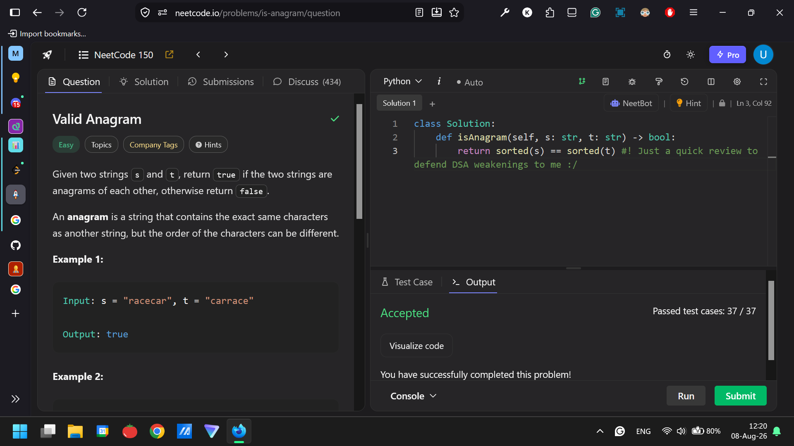
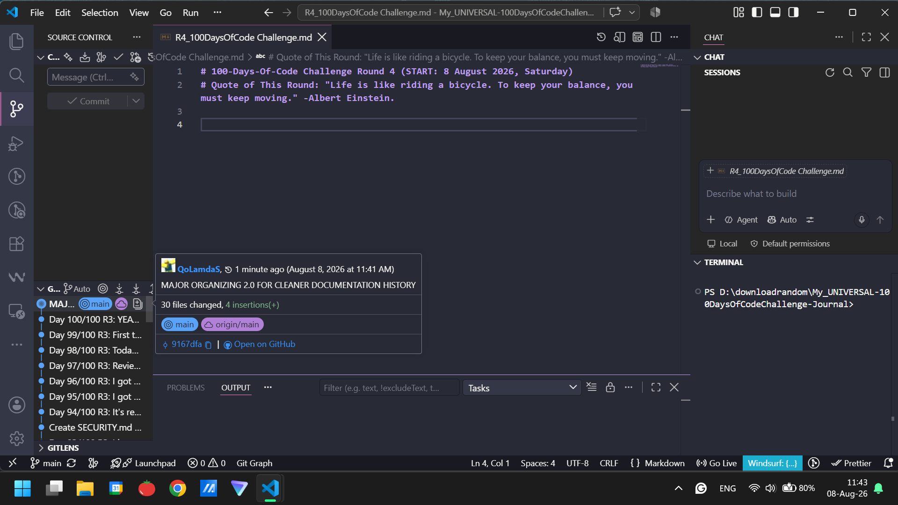
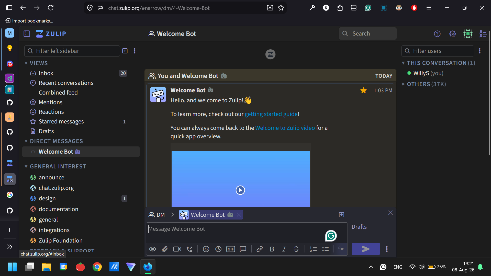
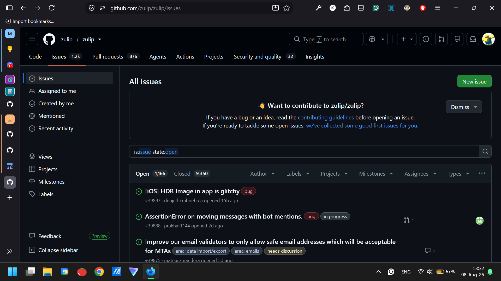

#100-days-of-code
Day 1/100 R4: 9 August 2026, Sunday
Daily Minimum >60mins❌; TOTAL => ≈40 mins
> What did I do this day?
- Overwhelmed to contribute to open-source GitHub repos for me. I really have no idea. It feels so intimidating for me with large code everywhere.
- I need to take a break for today because I consistently feel exhausted and really can't think. Maybe firstly I should building serious multiple independent projects in my GitHub repos for this month and then trying to contribute to open-source repos VScode GitHub.
- Today I am busy studying for my upcoming exams.
- Happy Learning!
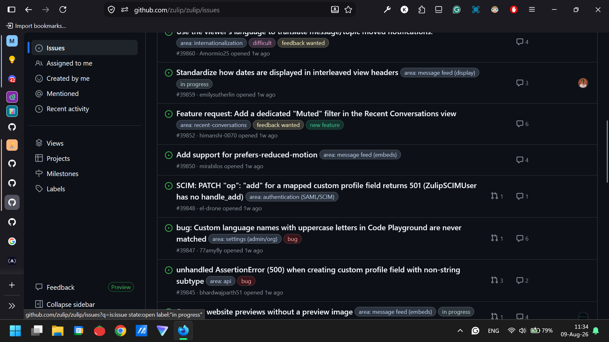

#100-days-of-code
Day 2/100 R4: 10 August 2026, Monday
Daily Minimum >60mins✅; TOTAL => ≈75 mins
> What did I do this day?
- Brainstorming independent project ideas and then later I want to build the simplest programming project about AI. Finally, Simple Text-based Email Spam Project inside my GitHub repo Independent-Multiple_Random-Projects = https://github.com/QoLamdaS/Independent-Multiple_Random-Projects.git
- Coding using Gemini AI and trying to figure it out adding feature CSV file in Pandas. It's harder than I thought to build this project even using Gemini AI lol =)
- I need to take a programming break for today. I can't think lol.
- Today I am really busy studying for my upcoming exams tomorrow. 
- Happy Learning!
- HAPPY CODING!!!
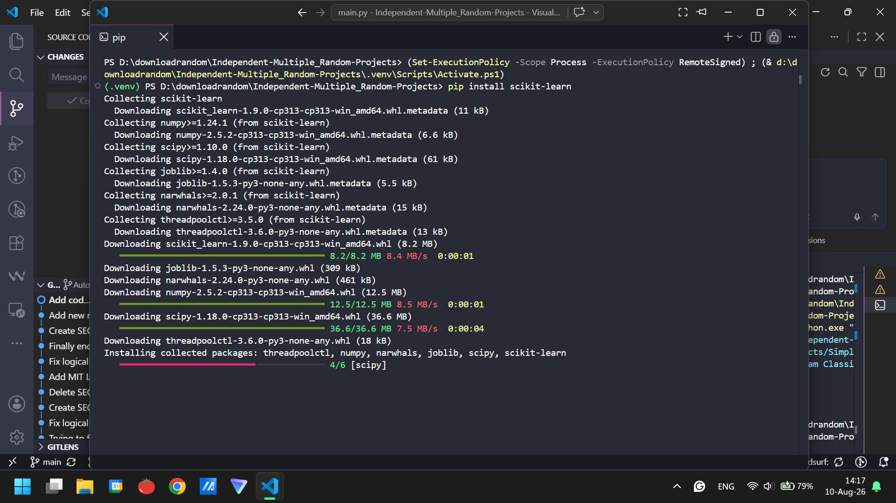
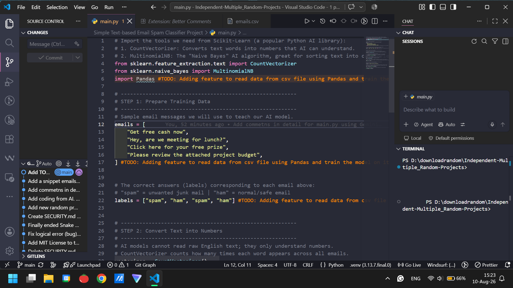
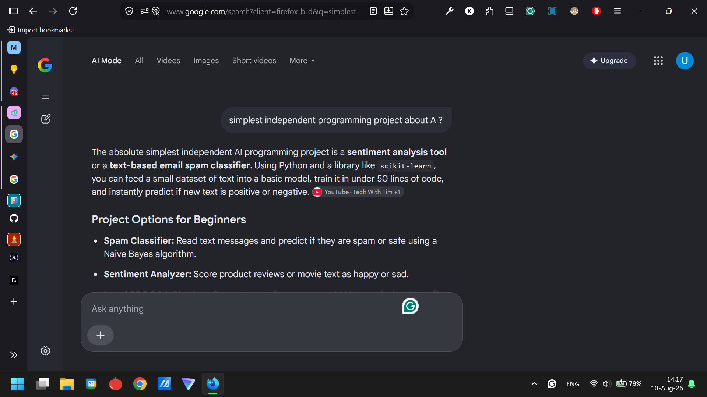

#100-days-of-code
Day 3/100 R4: 11 August 2026, Tuesday
Daily Minimum >60mins❌; TOTAL => ≈25 mins
> What did I do this day?
- Added a feature incorporating CSV file Pandas to my independent project Simple Text-based Email Spam. And then refactored a bit.
- Simple Text-based Email Spam Project inside my public GitHub repo Independent-Multiple_Random-Projects = https://github.com/QoLamdaS/Independent-Multiple_Random-Projects.git
- Added a larger dataset in a single CSV file "emails.csv" to feed/train the AI model for identifying spam or ham unseen email messages.
- Coding with a junior engineer Gemini AI (vibe coding). Trying to adapt new things =)
- I am really busy studying for physics and maths exams tomorrow. It's really tough exams for me.
- Happy Learning!!!
- HAPPY CODING!!!
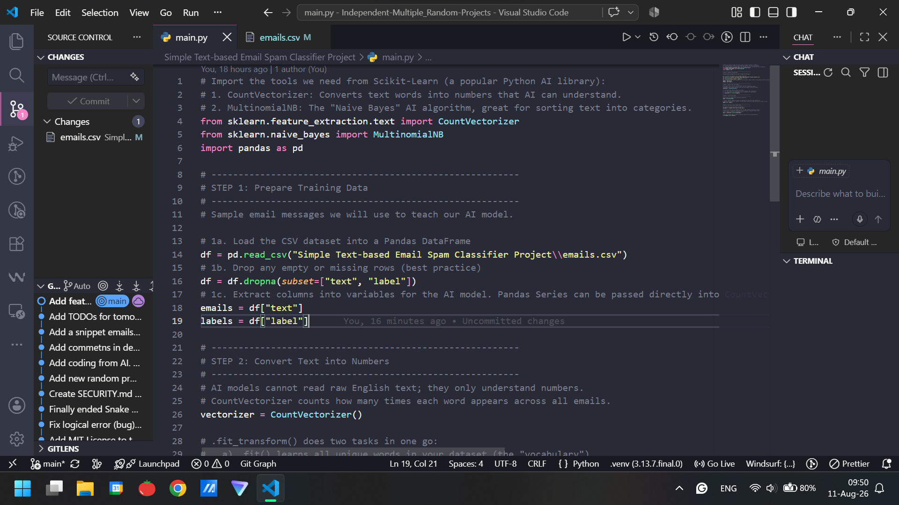
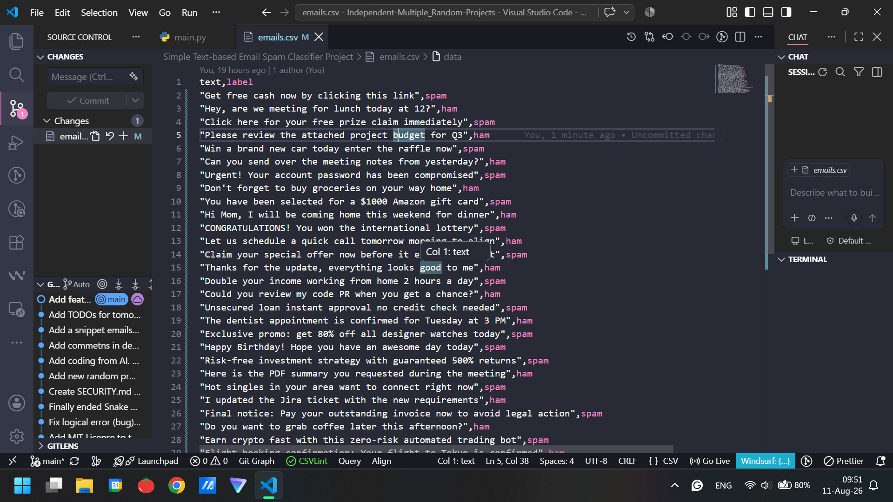

#100-days-of-code
Day 4/100 R4: 12 August 2026, Wednesday
Daily Minimum >60mins❌; TOTAL => ≈25 mins
> What did I do this day?
- Still working Simple Text-based Email Spam Project inside my public GitHub repo Independent-Multiple_Random-Projects = https://github.com/QoLamdaS/Independent-Multiple_Random-Projects.git 
- Added a 'prototype' feature where the user can input a custom email message to classify as spam or ham. Trying to polish UI/UX for users; temporarily CLI first and then maybe upgrade to GUI.
- Right now I'm really exhausted and so sleepy. I'm really so exhausted.
- Happy Learning!!!
- HAPPY CODING!!!
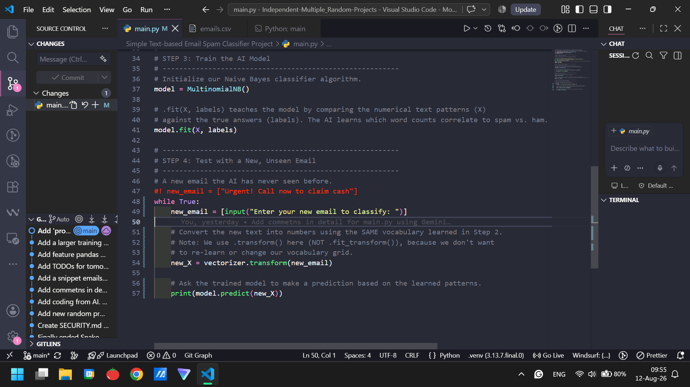

#100-days-of-code
Day 5/100 R4: 13 August 2026, Thursday
Daily Minimum >60mins✅; TOTAL => ≈70 mins
> What did I do this day?
- I got distracted a bit while doing programming. My bad hehehe :D
- Finally I decided to complete my independent Simple Text-based Email Spam Classifier Project inside my public GitHub repo Independent-Multiple_Random-Projects = https://github.com/QoLamdaS/Independent-Multiple_Random-Projects.git 
- Added a final polish for UI/UX for CLI users. And then finally finished "Simple Text-based Email Spam Classifier Project " today. YEAY!!!!!
- Brainstorming an idea to build a new independent project. I think I will build a WhatsApp bot for my phone.
- I am trying to learn vibe coding wisely and also self-learning programming skills from AI. I really have no idea.
- Happy Learning!!!
- HAPPY CODING!!!
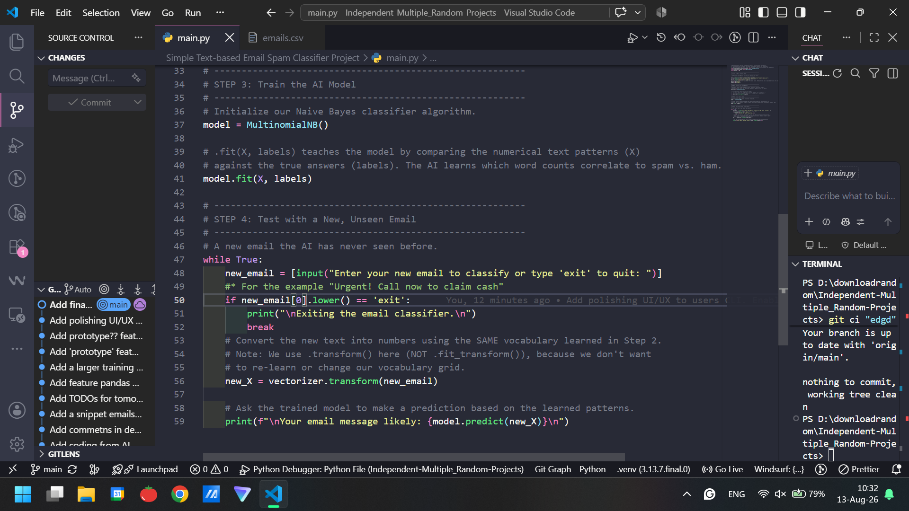
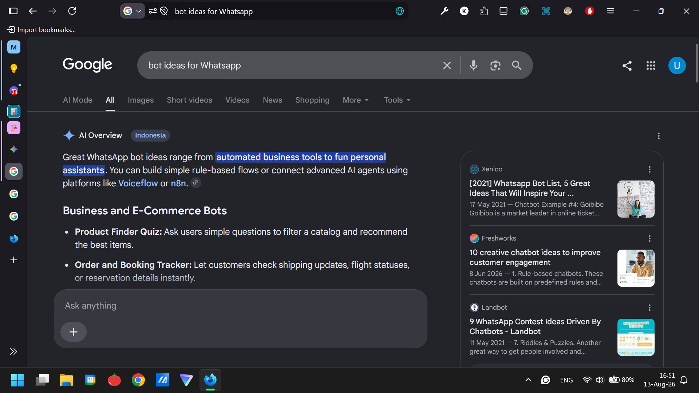

#100-days-of-code
Day 6/100 R4: 14 August 2026, Friday
Daily Minimum >60mins✅; TOTAL => ≈75 mins
> What did I do this day?
- I got distracted a bit while doing programming again hehehe :D
- Navigating Google AI Studio for programming/software engineering for the first time for me.
- Googling/researching how to use AI wisely to upskill my real programming skills and also avoid the form of Tutorial Hell (e.g. Vibe Coding blindly). And then, finally, I give Gemini AI instructions to act like a Socrates Tutor and explicitly avoid any form of Tutorial Hell when building projects (Project-Based Learning). Hopefully it works as I expected tomorrow.
- Just starting to work on a WhatsApp Bot project for my phone's daily notifications.
- Happy Learning!!!
- HAPPY CODING!!!
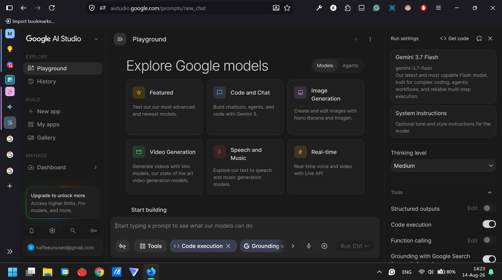
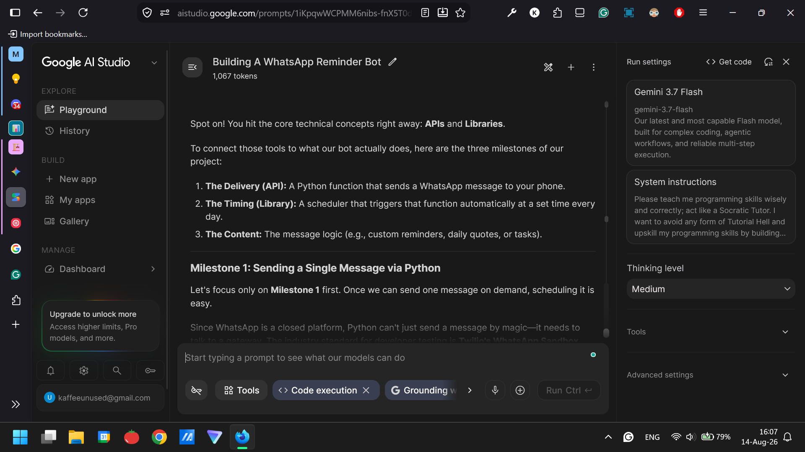

#100-days-of-code
Day 7/100 R4: 15 August 2026, Saturday
Daily Minimum >60mins✅; TOTAL => ≈168 mins
> What did I do this day?
- I got distracted a bit while doing programming also again hehehe xd :D
- Starting to work on "Simple-WhatsApp-Bot-ToMyPhone-Project" for my phone daily notification.
- Added boilerplate code and navigated Twilio with some help from Google AI Studio to teach me like a Socratic Tutor.
- Rewriting major overhaul of README.md in my universal #100DaysOfCode Challenge journals public repo to be more professional and cleaner for outsiders.
- I am trying to force myself to scrap my old habits in Git/GitHub and replacing with industry-standard good practices in Git/GitHub for building public repo projects. I'm not lying; I'm confused and struggling to understand Git/GitHub, honestly. I really have no idea.
- So in a nutshell, I must use Git/GitHub in a good practice industry-standard way from now on, ideal for an outsider seeing my public repo.
- Happy Learning!!!
- HAPPY CODING!!!
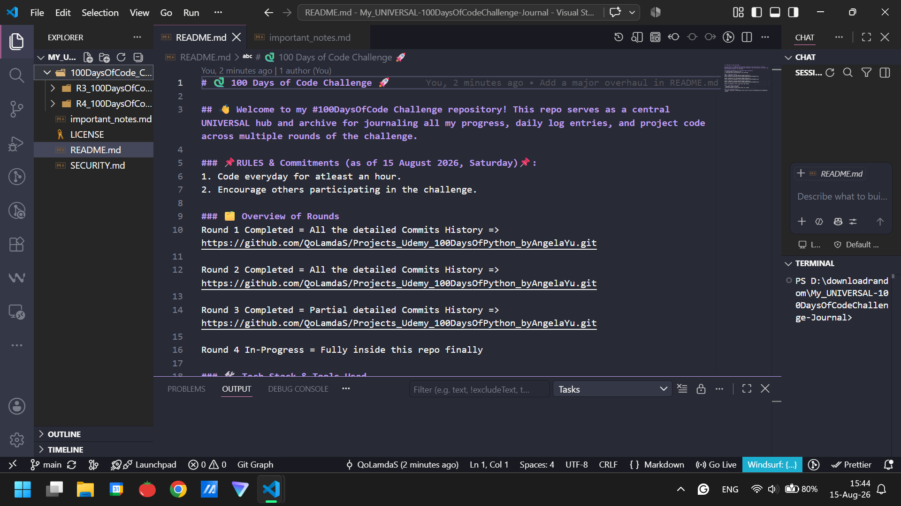
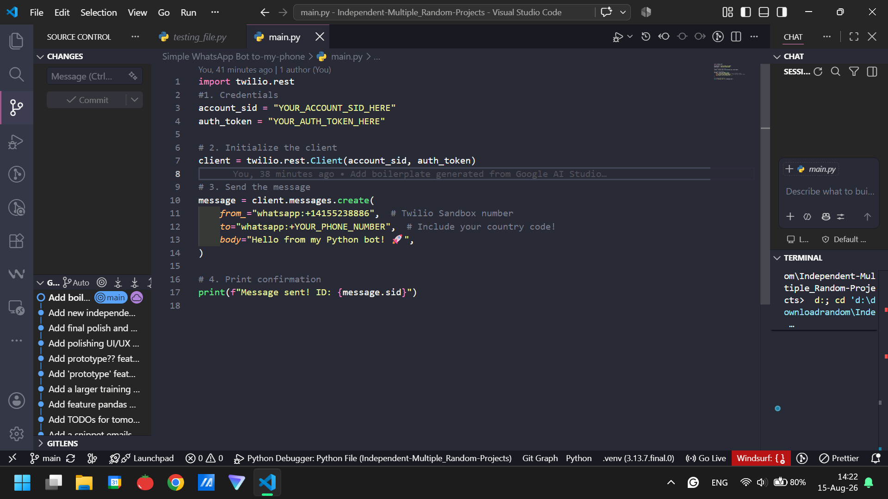
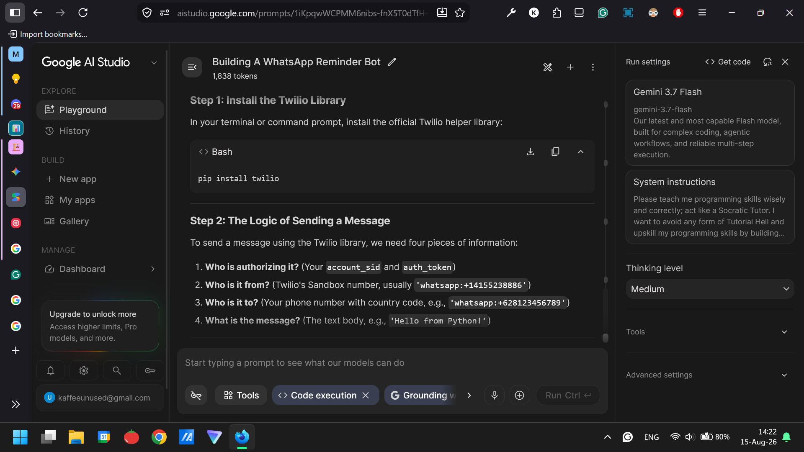
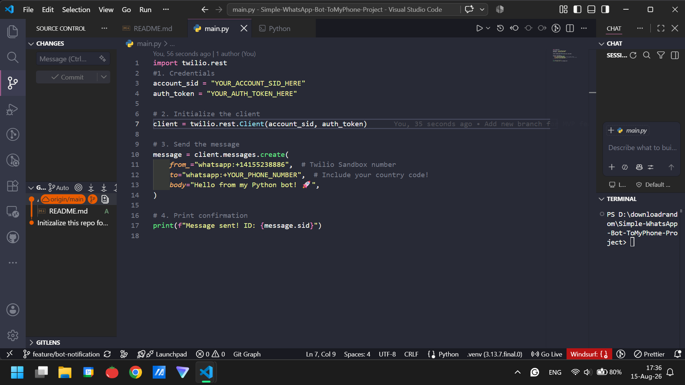
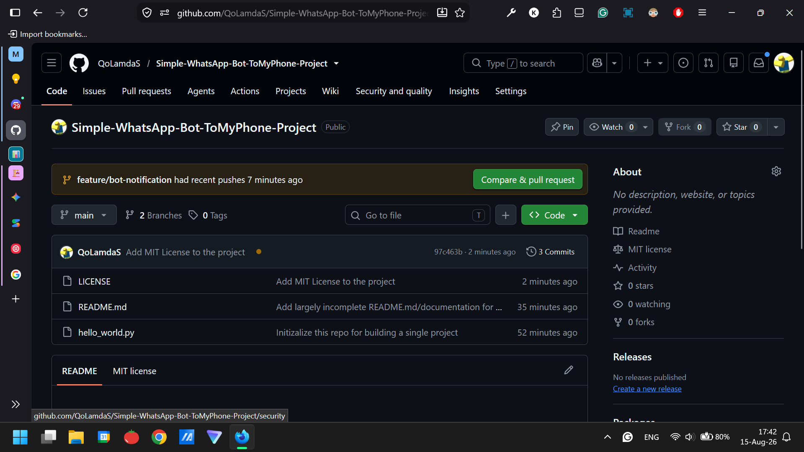

#100-days-of-code
Day 8/100 R4: 16 August 2026, Sunday
Daily Minimum >60mins❌; TOTAL => ≈8 mins
> What did I do this day?
- Today I got really busy due to busy family gatherings today 👨‍👩‍👧‍👦🚗🍽️🌴🧺. So today I'm just showing up only.
- Just reading about Git/GitHub common practices.
- Happy Learning!
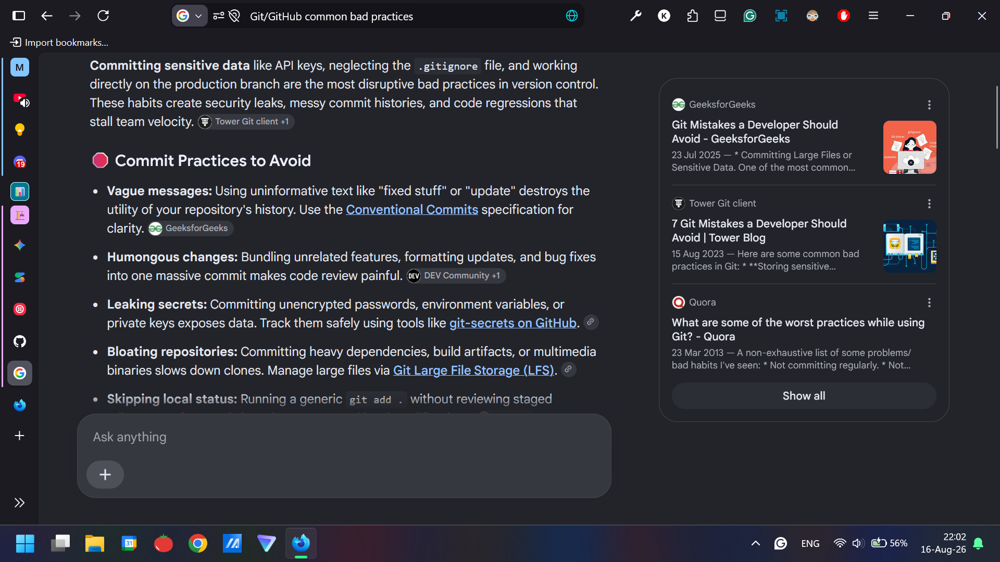

#100-days-of-code
Day 9/100 R4: 17 August 2026, Monday
Daily Minimum >60mins✅; TOTAL => ≈75 mins
> What did I do this day?
- Practicing industry-standard practices using Git/GitHub for API keys and similarly by setting up .env and .gitignore files inside VS Code firstly before committing. Good for me to really know.
- Implemented secrets using .env and .gitignore file inside VS Code for building my independent project "Simple WhatsApp Bot to-my-phone"; seemingly no problem after implementing this. My GitHub public repo = https://github.com/QoLamdaS/Simple-WhatsApp-Bot-ToMyPhone-Project.git
- I'm trying really hard to do debugging in building "Simple WhatsApp Bot to-my-phone" mini-project. Finding a mysterious bug. I really have no idea how to solve this. Maybe tomorrow I can solve it hopefully hehehe :D
- Trying to consistently build independent projects.
- HAPPY LEARNING!
- HAPPY CODING!!!
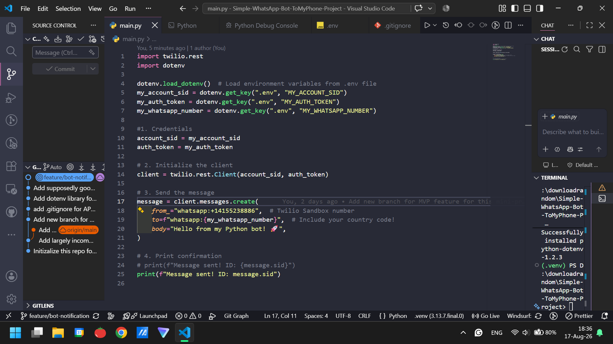
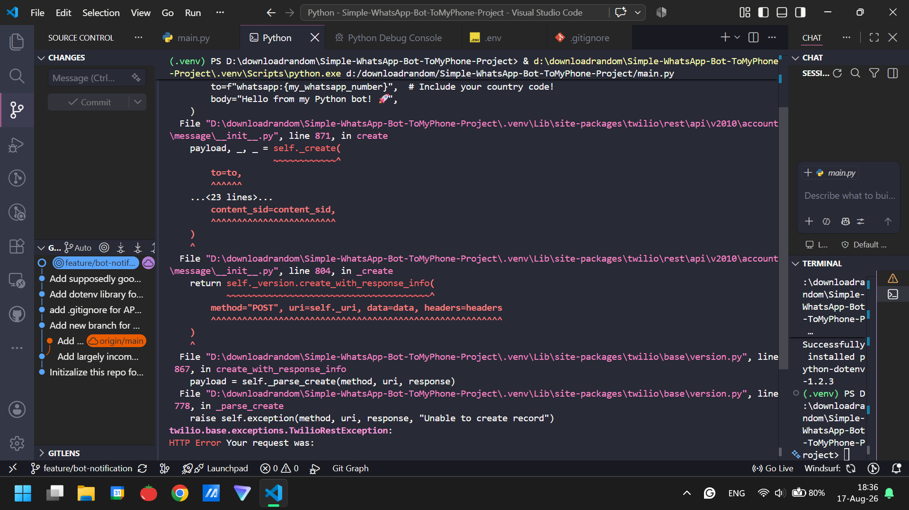

#100-days-of-code
Day 10/100 R4: 18 August 2026, Tuesday
Daily Minimum >60mins✅; TOTAL => ≈60 mins
> What did I do this day?
- Trying really hard to do debugging in building "Simple WhatsApp Bot to-my-phone" mini-project. Reading possible errors documentations. My GitHub public repo for this current project working on = https://github.com/QoLamdaS/Simple-WhatsApp-Bot-ToMyPhone-Project.git
- I am trying to implement AI solutions but strangely still caught the same error. This bug deceptively simple at glance for me. So frustrating to do debugging LMAO hehehehe =D
- Maybe tomorrow the bug fixed hopefully. So true that debugging is really harder than coding lol.
- HAPPY LEARNING!
- HAPPY CODING!!!
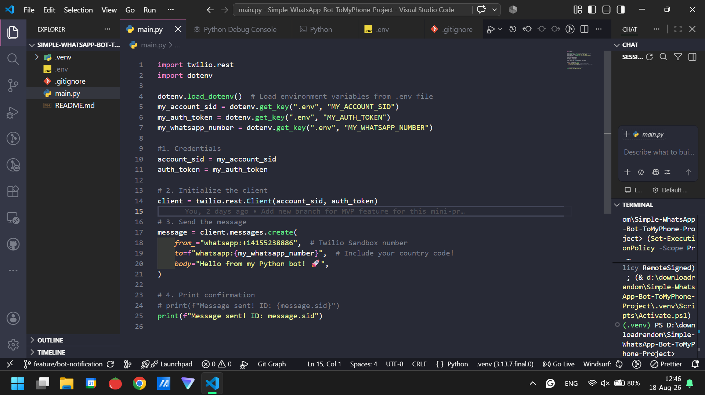
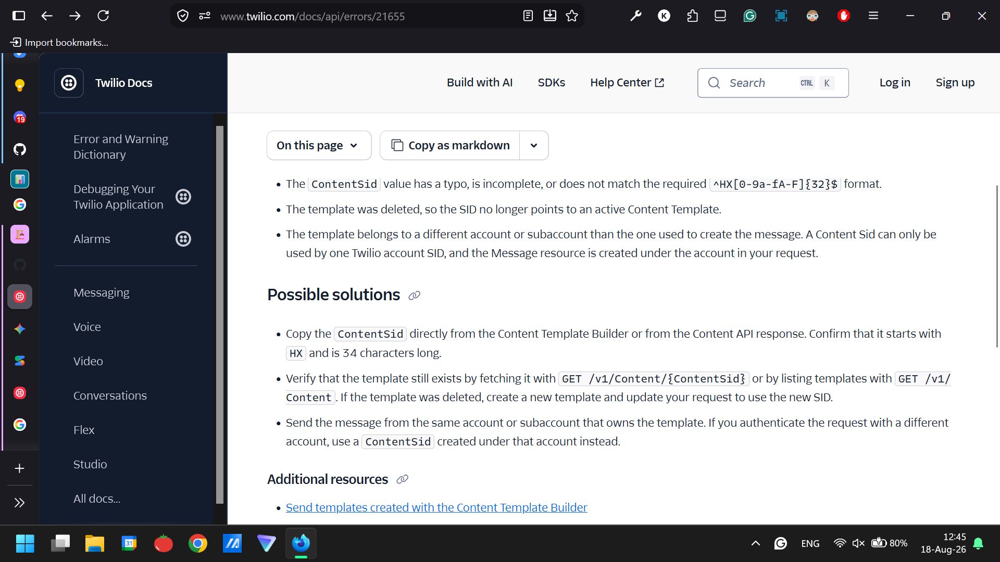
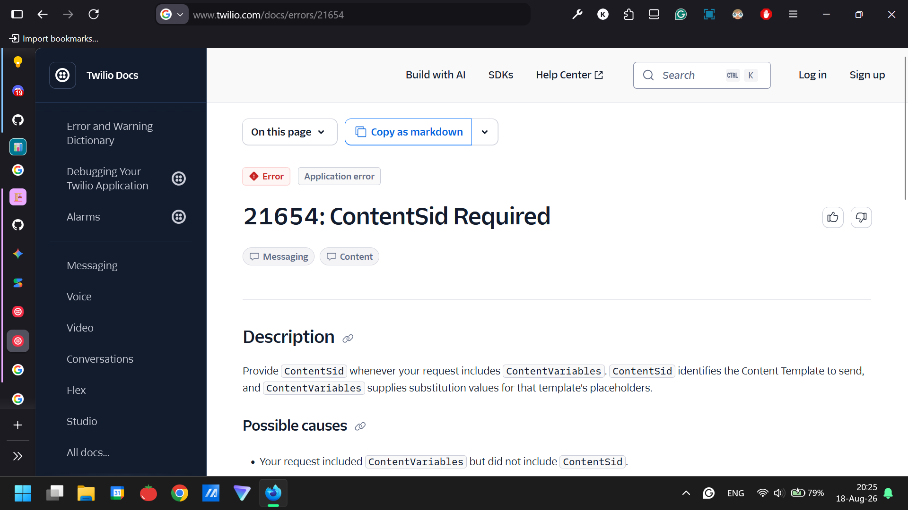

#100-days-of-code
Day 11/100 R4: 19 August 2026, Wednesday
Daily Minimum >60mins❌; TOTAL => ≈20 mins
> What did I do this day?
- Still trying really hard to do debugging in building "Simple WhatsApp Bot to-my-phone" mini-project, finding the same error from yesterday. My GitHub public repo for this current project working on = https://github.com/QoLamdaS/Simple-WhatsApp-Bot-ToMyPhone-Project.git
- Today I'm REAL so busy due to urgent family things. So I'm just showing up today.
- HAPPY LEARNING!
- HAPPY CODING!!!
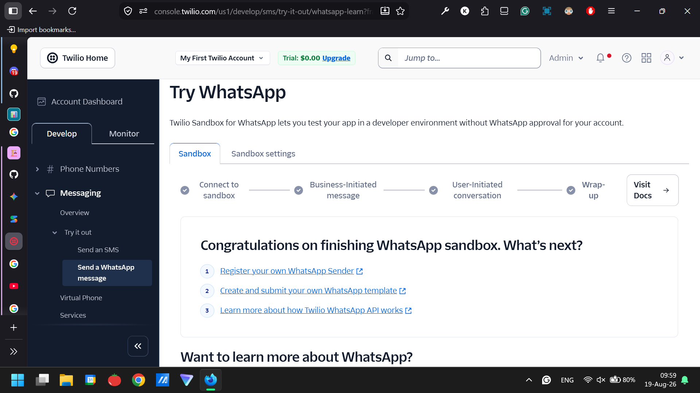

#100-days-of-code
Day 12/100 R4: 20 August 2026, Thursday 
Daily Minimum >60mins❌; TOTAL => ≈5 mins
> What did I do this day?
- Today I'm just showing up reading official Python documentation on my phone. I got sick Common Cold and headache moderately. My mind can't stop worrying my personal problems (private).
- Hopefully tomorrow will be better than today. I feel so down and exhausted today.
- Happy Learning!

#100-days-of-code
Day 13/100 R4: 21 August 2026, Friday
Daily Minimum >60mins❌; TOTAL => ≈38 mins
> What did I do this day?
- Trying desperately hard to get rid of the same bug from yesterday in my current project "Simple WhatsApp Bot to-my-phone". My GitHub public repo for this current mini-project = https://github.com/QoLamdaS/Simple-WhatsApp-Bot-ToMyPhone-Project.git
- Maybe I need to refactor completely I think tomorrow.
- Today I'm so busy and troubled with my personal problems (private).
- Happy Coding!
- Happy Learning!
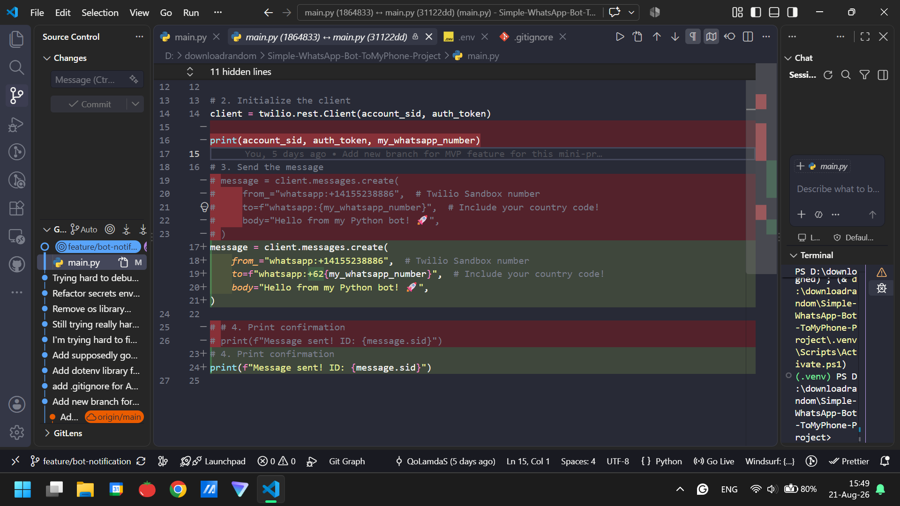

#100-days-of-code
Day 14/100 R4: 22 August 2026, Saturday
Daily Minimum >60mins❌; TOTAL => ≈5 mins
> What did I do this day?
- Just showing up for today by reading some Python 101 basics. I really got severely procrastinated a whole day; still troubled with my personal problems (private).
- Hopefully tomorrow will be over soon and I'll feel better.
- Happy Learning!
asdf
#100-days-of-code
Day 15/100 R4: 23 August 2026, Sunday
Daily Minimum >60mins❌; TOTAL => ≈10 mins
> What did I do this day?
- Just showing up today again. I really procrastinated severely for a whole day again; still troubled and anxious about my personal problems (private).
- Just adding some TODOs to my Google Tasks for my current working "Simple WhatsApp Bot to-my-phone" mini-project tomorrow.
- Hopefully tomorrow will get better. 
- Happy Learning!
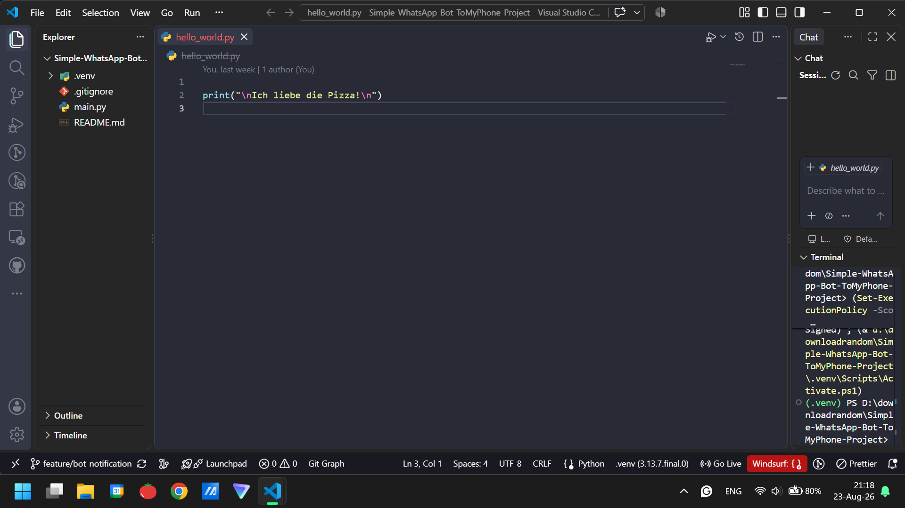

#100-days-of-code
Day 16/100 R4: 24 August 2026, Monday
Daily Minimum >60mins❌; TOTAL => ≈30 mins
> What did I do this day?
- Merged feature branch to main branch "production-ready" for my current working "Simple WhatsApp Bot to-my-phone" mini-project in good practice Git/GitHub.
- Still trying debugging for my current working mini-project "Simple WhatsApp Bot to-my-phone". I don't have idea how to fix. Maybe refactor it tomorrow.
- My GitHub public repo for this current mini-project = https://github.com/QoLamdaS/Simple-WhatsApp-Bot-ToMyPhone-Project.git
- Hopefully tomorrow will get better. I am really so exhausted and sleepy.
- HAPPY CODING!!!
- Happy Learning!
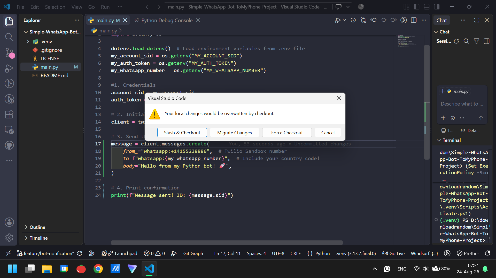

