# 100-Days-Of-Code Challenge Round 4 (START: 8 August 2026, Saturday)
# Quote of This Round: "Life is like riding a bicycle. To keep your balance, you must keep moving." -Albert Einstein.

#100-days-of-code
Day 0/100 R4: 8 August 2026, Saturday
Daily Minimum >60mins✅; TOTAL => ≈75 mins
> What did I do this day?
- Conducted major organizing (rework) to make my 100DaysOfCode Challenge Round 3 and Round 4 cleaner in my GitHub repo. A bit complicated lmao =)
- Just did a quick review solving the Valid Anagram problem on NeetCode 150 to defend my DSA skills from declining.
- Looking up open-source projects that I can contribute to as a rookie in VScode GitHub.
- I really have no idea how to contribute to the Zulip open-source project in GitHub. I think maybe I'll do a Good First Issue tomorrow if I have time, if I'm lucky. I really don't know =)
- Today I'm busy and also tired, I must study for my upcoming exams.
- Happy Learning!!!
- HAPPY CODING!

#100-days-of-code
Day 1/100 R4: 9 August 2026, Sunday
Daily Minimum >60mins❌; TOTAL => ≈40 mins
> What did I do this day?
- Overwhelmed to contribute to open-source GitHub repos for me. I really have no idea. It feels so intimidating for me with large code everywhere.
- I need to take a break for today because I consistently feel exhausted and really can't think. Maybe firstly I should building serious multiple independent projects in my GitHub repos for this month and then trying to contribute to open-source repos VScode GitHub.
- Today I am busy studying for my upcoming exams.
- Happy Learning!

#100-days-of-code
Day 2/100 R4: 10 August 2026, Monday
Daily Minimum >60mins✅; TOTAL => ≈75 mins
> What did I do this day?
- Brainstorming independent project ideas and then later I want to build the simplest programming project about AI. Finally, Simple Text-based Email Spam Project inside my GitHub repo Independent-Multiple_Random-Projects = https://github.com/QoLamdaS/Independent-Multiple_Random-Projects.git
- Coding using Gemini AI and trying to figure it out adding feature CSV file in Pandas. It's harder than I thought to build this project even using Gemini AI lol =)
- I need to take a programming break for today. I can't think lol.
- Today I am really busy studying for my upcoming exams tomorrow. 
- Happy Learning!
- HAPPY CODING!!!

#100-days-of-code
Day 3/100 R4: 11 August 2026, Tuesday
Daily Minimum >60mins❌; TOTAL => ≈25 mins
> What did I do this day?
- Added a feature incorporating CSV file Pandas to my independent project Simple Text-based Email Spam. And then refactored a bit.
- Simple Text-based Email Spam Project inside my public GitHub repo Independent-Multiple_Random-Projects = https://github.com/QoLamdaS/Independent-Multiple_Random-Projects.git
- Added a larger dataset in a single CSV file "emails.csv" to feed/train the AI model for identifying spam or ham unseen email messages.
- Coding with a junior engineer Gemini AI (vibe coding). Trying to adapt new things =)
- I am really busy studying for physics and maths exams tomorrow. It's really tough exams for me.
- Happy Learning!!!
- HAPPY CODING!!!

#100-days-of-code
Day 4/100 R4: 12 August 2026, Wednesday
Daily Minimum >60mins❌; TOTAL => ≈25 mins
> What did I do this day?
- Still working Simple Text-based Email Spam Project inside my public GitHub repo Independent-Multiple_Random-Projects = https://github.com/QoLamdaS/Independent-Multiple_Random-Projects.git 
- Added a 'prototype' feature where the user can input a custom email message to classify as spam or ham. Trying to polish UI/UX for users; temporarily CLI first and then maybe upgrade to GUI.
- Right now I'm really exhausted and so sleepy. I'm really so exhausted.
- Happy Learning!!!
- HAPPY CODING!!!

#100-days-of-code
Day 5/100 R4: 13 August 2026, Thursday
Daily Minimum >60mins✅; TOTAL => ≈70 mins
> What did I do this day?
- I got distracted a bit while doing programming. My bad hehehe :D
- Finally I decided to complete my independent Simple Text-based Email Spam Classifier Project inside my public GitHub repo Independent-Multiple_Random-Projects = https://github.com/QoLamdaS/Independent-Multiple_Random-Projects.git 
- Added a final polish for UI/UX for CLI users. And then finally finished "Simple Text-based Email Spam Classifier Project " today. YEAY!!!!!
- Brainstorming an idea to build a new independent project. I think I will build a WhatsApp bot for my phone.
- I am trying to learn vibe coding wisely and also self-learning programming skills from AI. I really have no idea.
- Happy Learning!!!
- HAPPY CODING!!!

#100-days-of-code
Day 6/100 R4: 14 August 2026, Friday
Daily Minimum >60mins✅; TOTAL => ≈75 mins
> What did I do this day?
- I got distracted a bit while doing programming again hehehe :D
- Navigating Google AI Studio for programming/software engineering for the first time for me.
- Googling/researching how to use AI wisely to upskill my real programming skills and also avoid the form of Tutorial Hell (e.g. Vibe Coding blindly). And then, finally, I give Gemini AI instructions to act like a Socrates Tutor and explicitly avoid any form of Tutorial Hell when building projects (Project-Based Learning). Hopefully it works as I expected tomorrow.
- Just starting to work on a WhatsApp Bot project for my phone's daily notifications.
- Happy Learning!!!
- HAPPY CODING!!!

#100-days-of-code
Day 7/100 R4: 15 August 2026, Saturday
Daily Minimum >60mins✅; TOTAL => ≈168 mins
> What did I do this day?
- I got distracted a bit while doing programming also again hehehe xd :D
- Starting to work on "Simple-WhatsApp-Bot-ToMyPhone-Project" for my phone daily notification.
- Added boilerplate code and navigated Twilio with some help from Google AI Studio to teach me like a Socratic Tutor.
- Rewriting major overhaul of README.md in my universal #100DaysOfCode Challenge journals public repo to be more professional and cleaner for outsiders.
- I am trying to force myself to scrap my old habits in Git/GitHub and replacing with industry-standard good practices in Git/GitHub for building public repo projects. I'm not lying; I'm confused and struggling to understand Git/GitHub, honestly. I really have no idea.
- So in a nutshell, I must use Git/GitHub in a good practice industry-standard way from now on, ideal for an outsider seeing my public repo.
- Happy Learning!!!
- HAPPY CODING!!!

#100-days-of-code
Day 8/100 R4: 16 August 2026, Sunday
Daily Minimum >60mins❌; TOTAL => ≈8 mins
> What did I do this day?
- Today I got really busy due to busy family gatherings today 👨‍👩‍👧‍👦🚗🍽️🌴🧺. So today I'm just showing up only.
- Just reading about Git/GitHub common practices.
- Happy Learning!

#100-days-of-code
Day 9/100 R4: 17 August 2026, Monday
Daily Minimum >60mins✅; TOTAL => ≈75 mins
> What did I do this day?
- Practicing industry-standard practices using Git/GitHub for API keys and similarly by setting up .env and .gitignore files inside VS Code firstly before committing. Good for me to really know.
- Implemented secrets using .env and .gitignore file inside VS Code for building my independent project "Simple WhatsApp Bot to-my-phone"; seemingly no problem after implementing this. My GitHub public repo = https://github.com/QoLamdaS/Simple-WhatsApp-Bot-ToMyPhone-Project.git
- I'm trying really hard to do debugging in building "Simple WhatsApp Bot to-my-phone" mini-project. Finding a mysterious bug. I really have no idea how to solve this. Maybe tomorrow I can solve it hopefully hehehe :D
- Trying to consistently build independent projects.
- HAPPY LEARNING!
- HAPPY CODING!!!

#100-days-of-code
Day 10/100 R4: 18 August 2026, Tuesday
Daily Minimum >60mins✅; TOTAL => ≈60 mins
> What did I do this day?
- Trying really hard to do debugging in building "Simple WhatsApp Bot to-my-phone" mini-project. Reading possible errors documentations. My GitHub public repo for this current project working on = https://github.com/QoLamdaS/Simple-WhatsApp-Bot-ToMyPhone-Project.git
- I am trying to implement AI solutions but strangely still caught the same error. This bug deceptively simple at glance for me. So frustrating to do debugging LMAO hehehehe =D
- Maybe tomorrow the bug fixed hopefully. So true that debugging is really harder than coding lol.
- HAPPY LEARNING!
- HAPPY CODING!!!

#100-days-of-code
Day 11/100 R4: 19 August 2026, Wednesday
Daily Minimum >60mins❌; TOTAL => ≈20 mins
> What did I do this day?
- Still trying really hard to do debugging in building "Simple WhatsApp Bot to-my-phone" mini-project, finding the same error from yesterday. My GitHub public repo for this current project working on = https://github.com/QoLamdaS/Simple-WhatsApp-Bot-ToMyPhone-Project.git
- Today I'm REAL so busy due to urgent family things. So I'm just showing up today.
- HAPPY LEARNING!
- HAPPY CODING!!!

#100-days-of-code
Day 12/100 R4: 20 August 2026, Thursday 
Daily Minimum >60mins❌; TOTAL => ≈5 mins
> What did I do this day?
- Today I'm just showing up reading official Python documentation on my phone. I got sick Common Cold and headache moderately. My mind can't stop worrying my personal problems (private).
- Hopefully tomorrow will be better than today. I feel so down and exhausted today.
- Happy Learning!

#100-days-of-code
Day 13/100 R4: 21 August 2026, Friday
Daily Minimum >60mins❌; TOTAL => ≈38 mins
> What did I do this day?
- Trying desperately hard to get rid of the same bug from yesterday in my current project "Simple WhatsApp Bot to-my-phone". My GitHub public repo for this current mini-project = https://github.com/QoLamdaS/Simple-WhatsApp-Bot-ToMyPhone-Project.git
- Maybe I need to refactor completely I think tomorrow.
- Today I'm so busy and troubled with my personal problems (private).
- Happy Coding!
- Happy Learning!

#100-days-of-code
Day 14/100 R4: 22 August 2026, Saturday
Daily Minimum >60mins❌; TOTAL => ≈5 mins
> What did I do this day?
- Just showing up for today by reading some Python 101 basics. I really got severely procrastinated a whole day; still troubled with my personal problems (private).
- Hopefully tomorrow will be over soon and I'll feel better.
- Happy Learning!
asdf
#100-days-of-code
Day 15/100 R4: 23 August 2026, Sunday
Daily Minimum >60mins❌; TOTAL => ≈10 mins
> What did I do this day?
- Just showing up today again. I really procrastinated severely for a whole day again; still troubled and anxious about my personal problems (private).
- Just adding some TODOs to my Google Tasks for my current working "Simple WhatsApp Bot to-my-phone" mini-project tomorrow.
- Hopefully tomorrow will get better. 
- Happy Learning!

#100-days-of-code
Day 16/100 R4: 24 August 2026, Monday
Daily Minimum >60mins❌; TOTAL => ≈30 mins
> What did I do this day?
- Merged feature branch to main branch "production-ready" for my current working "Simple WhatsApp Bot to-my-phone" mini-project in good practice Git/GitHub.
- Still trying debugging for my current working mini-project "Simple WhatsApp Bot to-my-phone". I don't have idea how to fix. Maybe refactor it tomorrow.
- My GitHub public repo for this current mini-project = https://github.com/QoLamdaS/Simple-WhatsApp-Bot-ToMyPhone-Project.git
- Hopefully tomorrow will get better. I am really so exhausted and sleepy.
- HAPPY CODING!!!
- Happy Learning!

#100-days-of-code
Day 17/100 R4: 25 August 2026, Tuesday
Daily Minimum >60mins❌; TOTAL => ≈5 mins
> What did I do this day?
- I severely procrastinated all day to do programming.  I'm so sorry =(
- I'm really busy fixing my troubled personal problems. I'm so anxious.
- Just Showing Up for today, read DSA concepts a bit (Googling).
- Tomorrow I "must" take serious programming. Hopefully yes.
- Happy Learning!

🧊Day 18/100 R4❄️: 26 August 2026, Wednesday🧊
> Why I missed that day:
- I missed that day (26 August 2026, Wednesday) because my mother went to the hospital urgently (emergencies). And I honestly, really forgot to do journaling #100-days-of-code challenge for that day. I'm sorry for missing that day. 
- At least do not miss two days consecutively "Never Miss Twice" rule by James Clear (Don't miss twice in a row).

#100-days-of-code
Day 18/100 R4: 27 August 2026, Thursday
Daily Minimum >60mins❌; TOTAL => ≈45 mins
> What did I do this day?
-  My GitHub public repo for this current mini-project = https://github.com/QoLamdaS/Simple-WhatsApp-Bot-ToMyPhone-Project.git
- Added a separate bugfix branch for debugging my current working "Simple WhatsApp Bot to-my-phone" mini-project.
- Hopelessly debugging and refactoring without producing any single solution for the same error in my current working project. It's really frustrating and so undeniable.
- I think maybe I should abandon my current working project for good. Yeah, maybe I do that tomorrow.
- Happy Coding!
- Happy Learning!
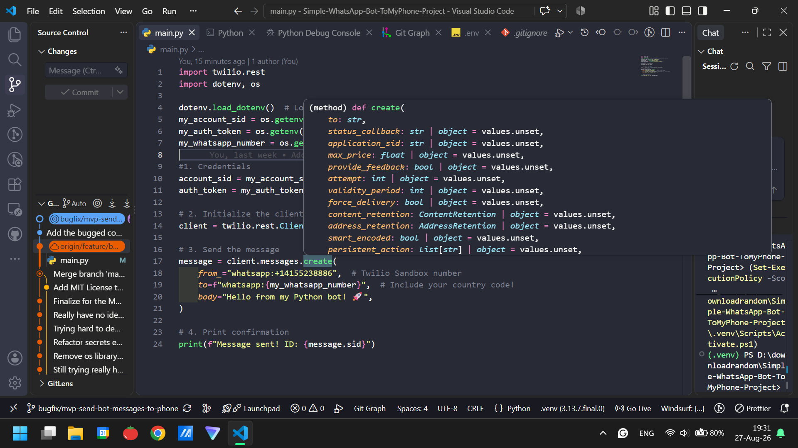

#100-days-of-code
Day 19/100 R4: 28 August 2026, Friday
Daily Minimum >60mins✅; TOTAL => ≈90 mins
> What did I do this day?
- Today, a bit distracted while programming doomscrolling social media. Don't doomscroll.
-  My GitHub public repo for my "Simple WhatsApp Bot to-my-phone" mini-project  = https://github.com/QoLamdaS/Simple-WhatsApp-Bot-ToMyPhone-Project.git
- Add a simple official README professionally for "Simple WhatsApp Bot to-my-phone" mini-project  as a clousure (DISCONTINUED) due to cost constraints (NOT FREE FOR BOT) with the help of Gemini AI for writing it professionally hehehe =)
- Just starting to build a personal Discord bot using Python with Google AI Studio teaching act like a Socratic Tutor. Firstly brainstorming Discord vs WhatsApp vs Telegram and then setting up a public GitHub repo optimally with good practices.
- Check my current working mini-project = https://github.com/QoLamdaS/py-simple-personal-discord-bot.git
- HAPPY CODING!!!
- HAPPY LEARNING!!!
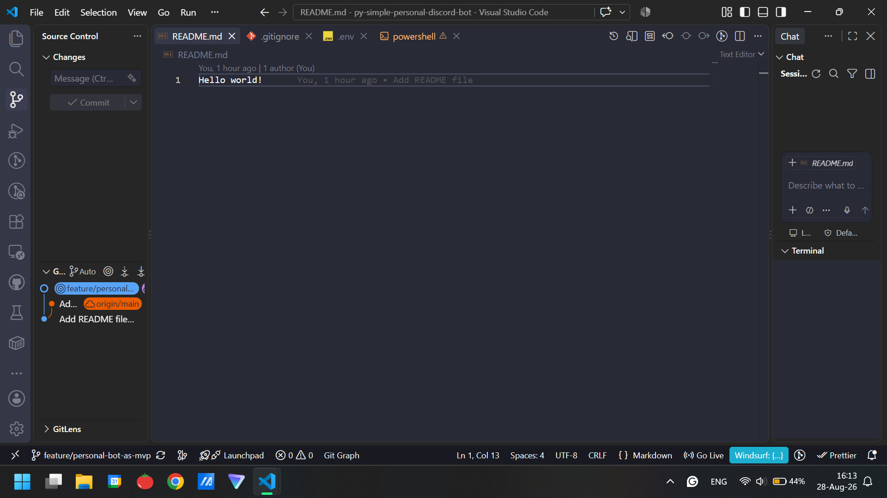
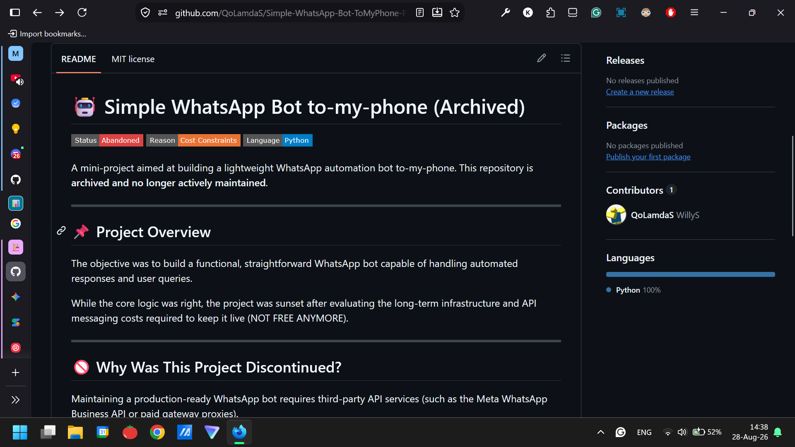

#100-days-of-code
Day 20/100 R4: 29 August 2026, Saturday
Daily Minimum >60mins❌; TOTAL => ≈40 mins
> What did I do this day?
- Today I'm busy because of family gatherings this weekend quality time 👨‍👩‍👧‍👦🚗🍽️🌴🧺.
- Building a personal Discord bot using Python with Google AI Studio until the MVP works. Check my current working mini-project = https://github.com/QoLamdaS/py-simple-personal-discord-bot.git
- Trying to utilize an AI LLM prompt for upskilling my programming skills effectively and efficiently through custom instructions as a Socratic Coding Tutor and never giving full direct solutions to me. Trying to apply AI FLUENCY Anthropic.
- HAPPY CODING!!!
- HAPPY LEARNING!!!
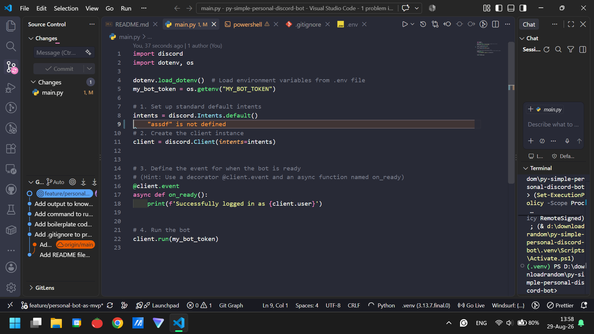
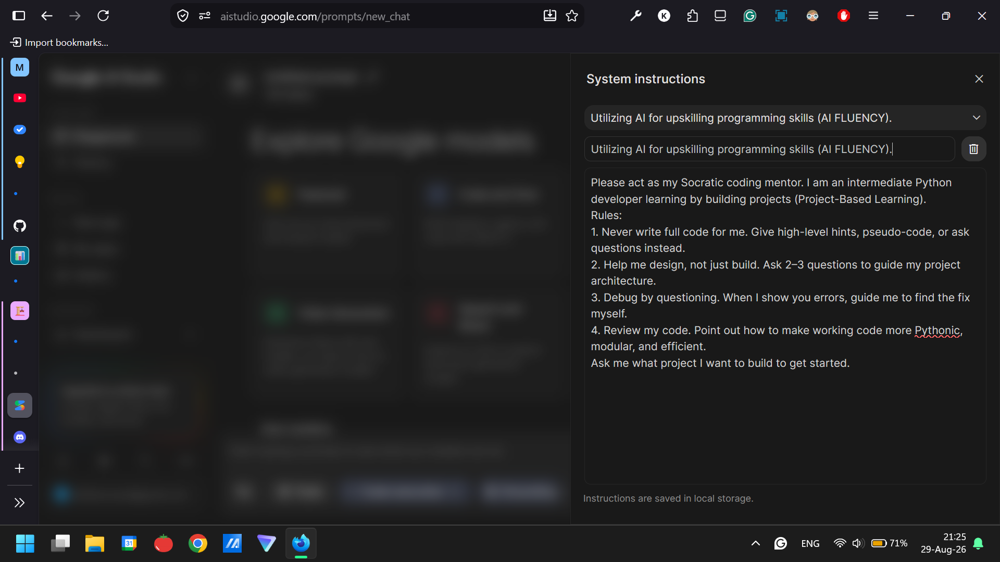

#100-days-of-code
Day 21/100 R4: 30 August 2026, Sunday
Daily Minimum >60mins❌; TOTAL => ≈20 mins
> What did I do this day?
- Today I'm also busy because of family gatherings this weekend quality time 👨‍👩‍👧‍👦🚗🍽️🌴🧺.
- I got distracted a bit while programming hehehe =)
- Honestly, I feel confused about how to utilize AI LLMs effectively and efficiently for upskilling my programming skills actually lol. Even though I am trying to apply AI FLUENCY Anthropic as a Socratic Coding Mentor through custom instructions in Google AI Studio.
- Still working on "Simple Personal Discord Bot" project using Python with Google AI Studio Socratic Coding Mentor custom instructions. Check my current working mini-project = https://github.com/QoLamdaS/py-simple-personal-discord-bot.git
- HAPPY CODING!!!
- HAPPY LEARNING!!!
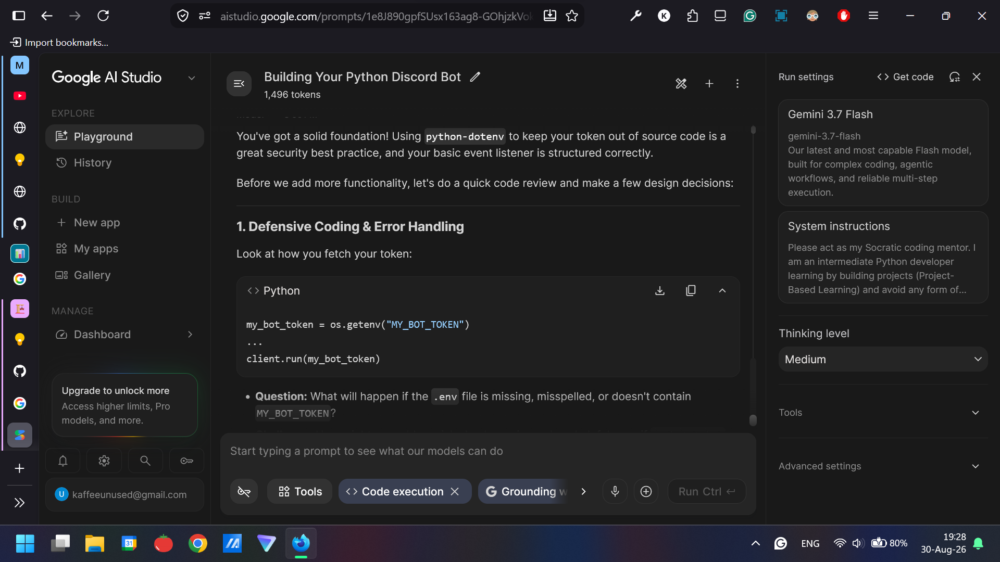

#100-days-of-code
Day 22/100 R4: 31 August 2026, Monday
Daily Minimum >60mins✅; TOTAL => ≈60 mins
> What did I do this day?
- Honestly I still feel confused and overwhelmed about how to utilize AI LLMs effectively and efficiently for upskilling my programming skills actually lol. I am trying to apply AI FLUENCY Anthropic as a Socratic Coding Mentor through custom instructions in Google AI Studio for building a "Simple Personal Discord Bot" mini-project using Python.
- Doing programming on "Simple Personal Discord Bot" mini-project, enabling it to respond to custom commands and send scheduled reminders. Using Google AI Studio Socratic Coding Mentor and googling as a tool while doing programming.
- Check my current working mini-project = https://github.com/QoLamdaS/py-simple-personal-discord-bot.git
- HAPPY CODING!!!
- HAPPY LEARNING!!!
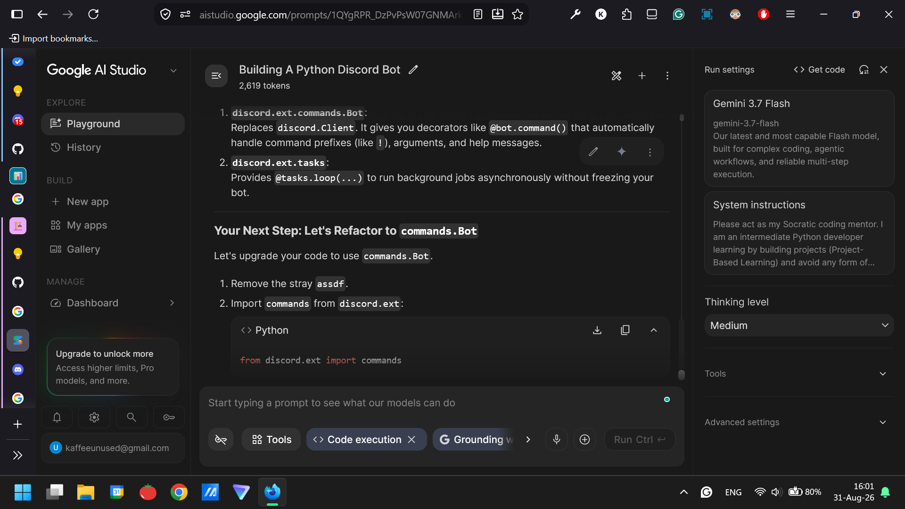
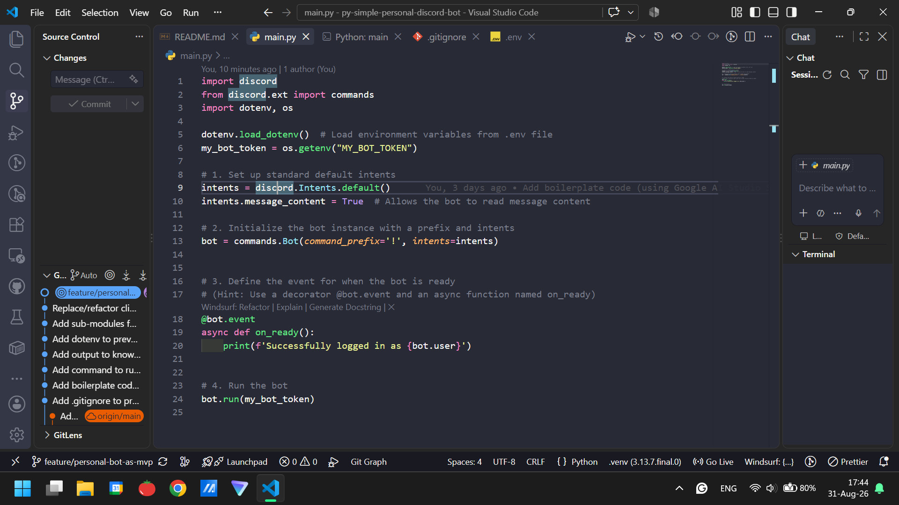
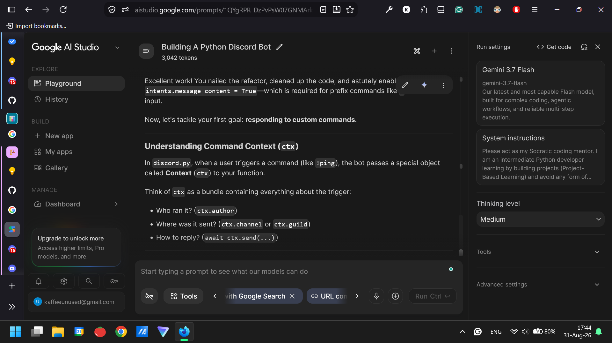

#100-days-of-code
Day 23/100 R4: 1 September 2026, Tuesday
Daily Minimum >60mins❌; TOTAL => ≈5 mins
> What did I do this day?
- Just showing up for today only because I am cramming for my tough physics school exam tomorrow.
- Just reading a bit on Google AI Studio as a Socratic coding mentor for working on the "Simple Personal Discord Bot" mini-project.
- Check my current working mini-project = https://github.com/QoLamdaS/py-simple-personal-discord-bot.git
- HAPPY CODING!!!
- HAPPY LEARNING!!!
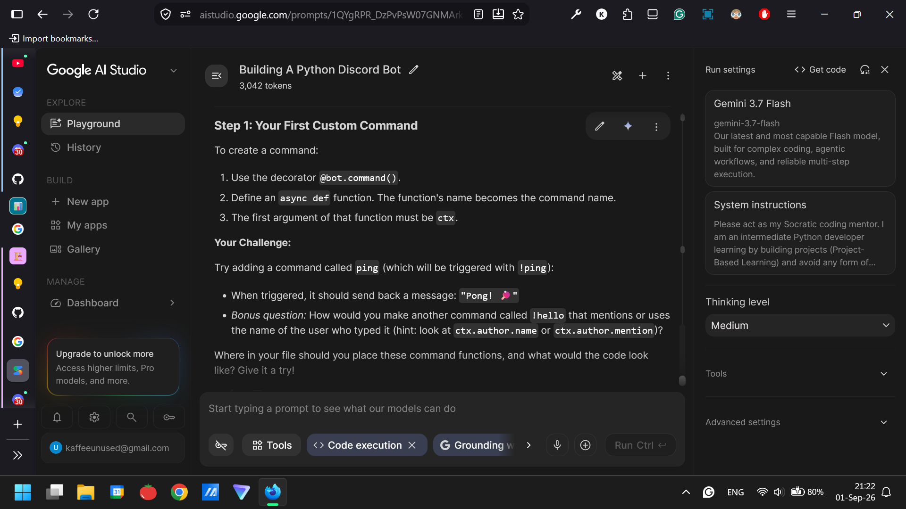

#100-days-of-code
Day 24/100 R4: 2 September 2026, Wednesday
Daily Minimum >60mins❌; TOTAL => ≈5 mins
> What did I do this day?
- Just showing up for today by just reading a bit about programming basics 101.
- Today I'm really busy today and got sick headaches + Common Cold moderately (UNLUCKY TODAY)
- Happy Learning!

#100-days-of-code
Day 25/100 R4: 3 September 2026, Thursday
Daily Minimum >60mins✅; TOTAL => ≈116 mins
> What did I do this day?
- Completed achieving MVP "Simple Personal Discord Bot" mini-project goals (my Python code is alright), but it doesn't work as supposedly.
- The code is actually really simple. But, if I try to send "!ping" on my own testing bot Discord server, the bot doesn't reply anything at all and also my bot can't get into my testing bot Discord server, even I try to forcefully fix that bug like enabling all permissions and grant privileged access. This bug really makes me incredibly more confused than ever and so time-consuming.
- Really insanely hard debugging today (70% of the time was spent doing debugging)
- So today basically I'm debugging one of the hardest types of bugs in software engineering. The bug is really unusual and so strange. I really have no idea. Maybe tomorrow will be better, hopefully. I'm so exhausted from debugging.
- Check my current working mini-project = https://github.com/QoLamdaS/py-simple-personal-discord-bot.git
- HAPPY CODING!!!
- HAPPY LEARNING!!!
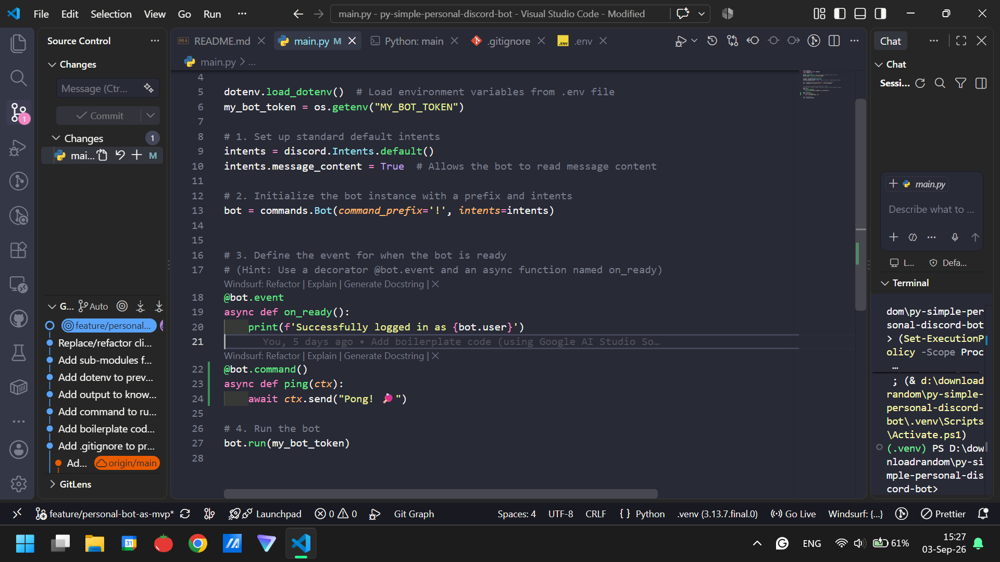
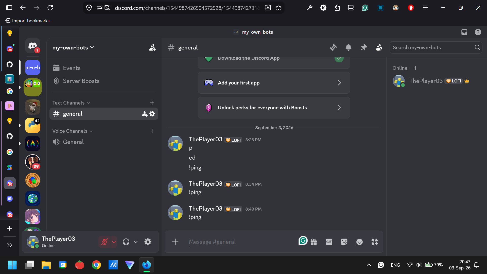
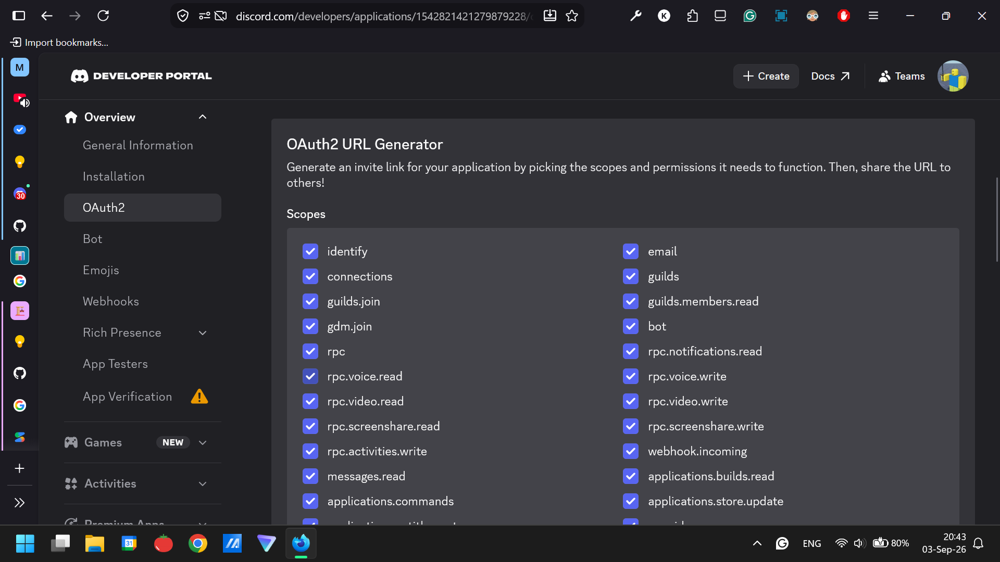
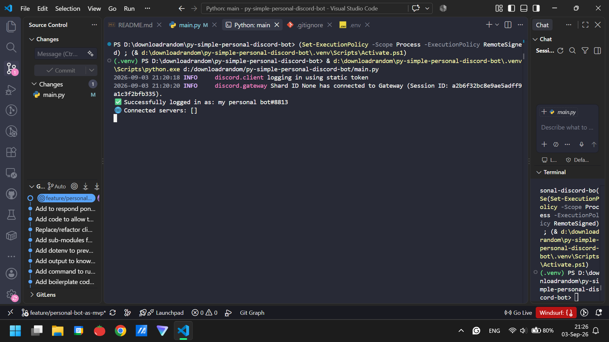

#100-days-of-code
Day 26/100 R4: 4 September 2026, Friday
Daily Minimum >60mins❌; TOTAL => ≈5 mins
> What did I do this day?
- Really so exhausted due to straight severe sleep deprivation last weeks. I really need to take a break only for today.
- Just showing up by reading Python programming 101 basics.
- Happy Learning!

#100-days-of-code
Day 27/100 R4: 5 September 2026, Saturday
Daily Minimum >60mins✅; TOTAL => ≈105 mins
> What did I do this day?
- Optimized VS Code to be faster and not laggy on my low-end laptop.
- Finally, my Discord bot replies "pong🏓!" after I send "!ping" as intended. I already spent an hour debugging this problem by asking multiple times to Gemini AI with "useless" generated solutions for fixing this problem.
- The root cause of the problem is actually about OAuth2 Scopes (only enable bot and application.commands; not by enabling all of them) in the Discord Developer Portal. My Python code is actually 100% alright from yesterday. I know the solution from screenshotting and then asking it to Gemini AI. The prompt is really crucial to utilize AI effectively. I think the solution is so bizarre lol.
- Finally, I can advance the "py-simple-personal-discord-bot" mini-project developing more features. I'm getting rid of yesterday's problem YEAY!!!!
- It is so frustrating and so tiring to get rid of this problem. Finally, I successfully fixed it YEAY!!!!
- Check my current working mini-project = https://github.com/QoLamdaS/py-simple-personal-discord-bot.git
- HAPPY CODING!!!
- Happy Learning!
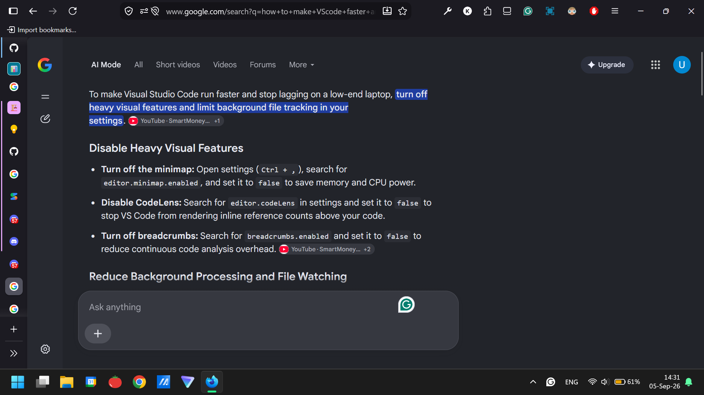
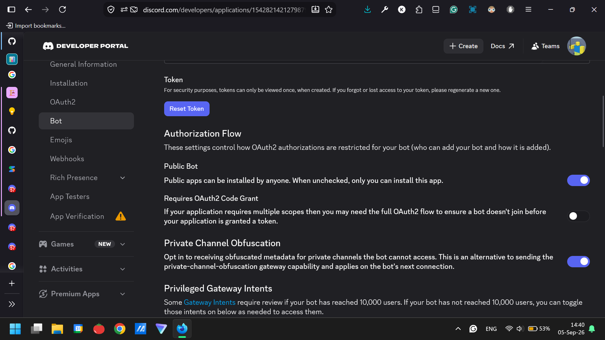
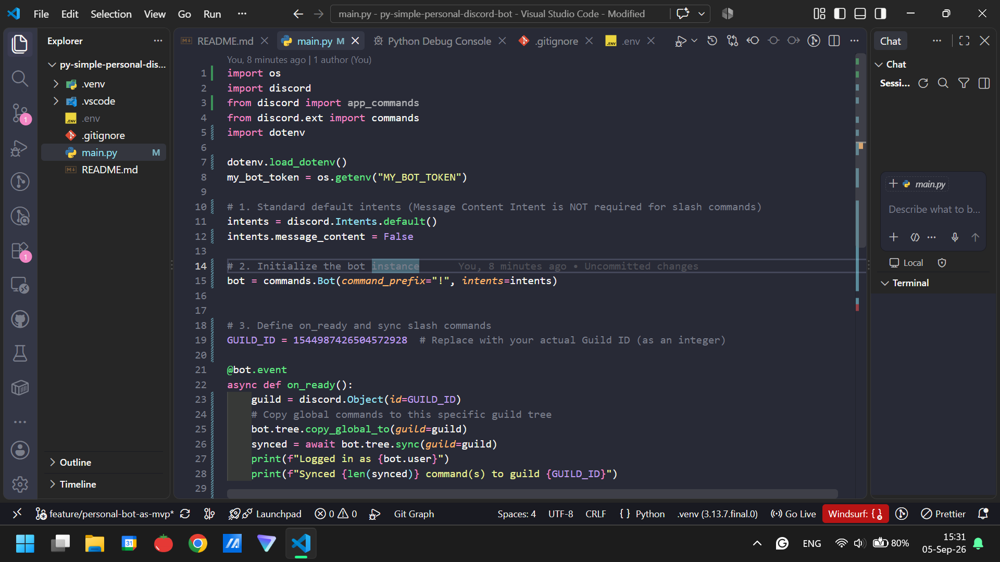
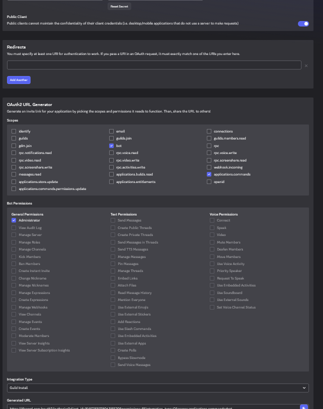
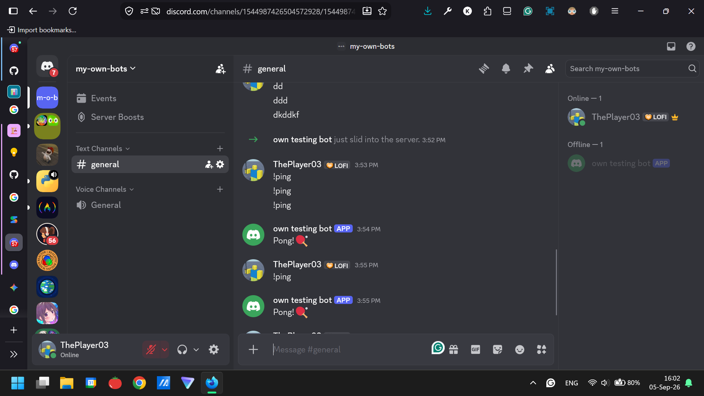

#100-days-of-code
Day 28/100 R4: 6 September 2026, Sunday
Daily Minimum >60mins❌; TOTAL => ≈35 mins
> What did I do this day?
- I just showed up today because I'm so busy for this Sunday because I have spending quality time with my family for this weekend 👨‍👩‍👧‍👦🚗🍽️🌴🧺🏓.
- Merging the feature MVP branch into the production-ready main branch using good practices Git/GitHub for "py-simple-personal-discord-bot" mini-project.
- And then I learned about some of the GitHub branching strategies. I picked the GitHub Flow branching strategy because it's simple and recommended for mini-projects hehehe =)
- Check my current working mini-project = https://github.com/QoLamdaS/py-simple-personal-discord-bot.git
- HAPPY CODING!!!
- Happy Learning!
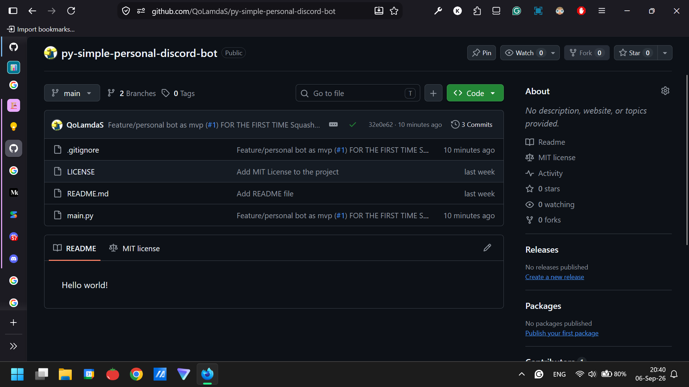

